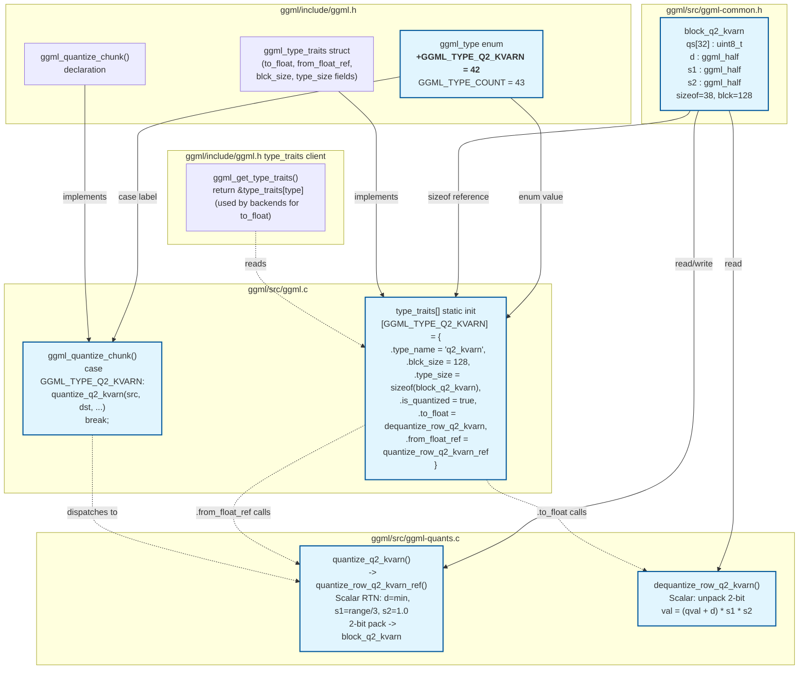

### File Ownership Summary

| File | What it contributes |
|------|---------------------|
| `ggml/include/ggml.h` | Enum value, struct declaration, chunk declaration |
| `ggml/src/ggml-common.h` | `block_q2_kvarn` struct definition |
| `ggml/src/ggml.c` | type_traits entry, quantize_chunk dispatch case |
| `ggml/src/ggml-quants.c` | `quantize_q2_kvarn`, `quantize_row_q2_kvarn_ref`, `dequantize_row_q2_kvarn` implementations |

### External Interfaces

| Interface | Direction | Consumers |
|-----------|-----------|-----------|
| `ggml_quantize_chunk(type=Q2_KVARN, ...)` | Input | llama.cpp KV-cache layer, model conversion |
| `ggml_type_traits[Q2_KVARN].to_float()` | Input | CPU backend (ggml_compute_forward), GPU backend |
| `ggml_type_traits[Q2_KVARN].from_float_ref()` | Input | CPU backend, quantization path |
| `block_q2_kvarn` memory layout | Data | All backends that read/write Q2_KVARN tensors |
