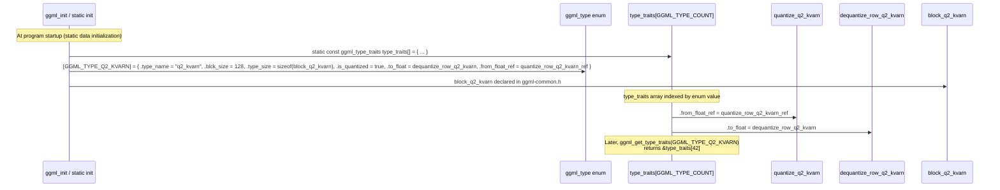
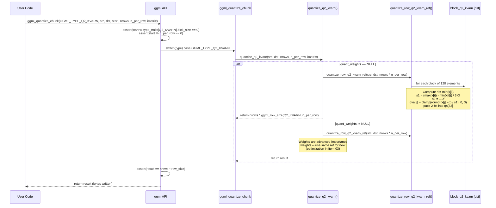
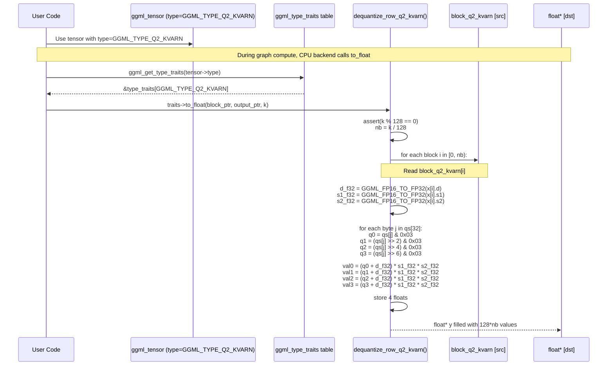

# 1. Type Registration

```mermaid
sequenceDiagram
    participant Init as ggml_init / static init
    participant Enum as ggml_type enum
    participant Traits as type_traits[GGML_TYPE_COUNT]
    participant Quant as quantize_q2_kvarn
    participant Dequant as dequantize_row_q2_kvarn
    participant Struct as block_q2_kvarn

    Note over Init: At program startup (static data initialization)

    Init->>Traits: static const ggml_type_traits type_traits[] = { ... }
    Init->>Enum: [GGML_TYPE_Q2_KVARN] = { .type_name = "q2_kvarn", .blck_size = 128, .type_size = sizeof(block_q2_kvarn), .is_quantized = true, .to_float = dequantize_row_q2_kvarn, .from_float_ref = quantize_row_q2_kvarn_ref }
    Init->>Struct: block_q2_kvarn declared in ggml-common.h

    Note over Traits: type_traits array indexed by enum value
    
    Traits->>Quant: .from_float_ref = quantize_row_q2_kvarn_ref
    Traits->>Dequant: .to_float = dequantize_row_q2_kvarn

    Note over Traits: Later, ggml_get_type_traits(GGML_TYPE_Q2_KVARN)<br/>returns &type_traits[42]
```

# 2. Quantize Dispatch

```mermaid
sequenceDiagram
    participant User as User Code
    participant API as ggml API
    participant Chunk as ggml_quantize_chunk
    participant QFunc as quantize_q2_kvarn()
    participant Ref as quantize_row_q2_kvarn_ref()
    participant Block as block_q2_kvarn [dst]

    User->>API: ggml_quantize_chunk(GGML_TYPE_Q2_KVARN, src, dst, start, nrows, n_per_row, imatrix)
    
    API->>API: assert(start % type_traits[Q2_KVARN].blck_size == 0)<br/>assert(start % n_per_row == 0)
    
    API->>Chunk: switch(type) case GGML_TYPE_Q2_KVARN
    
    Chunk->>QFunc: quantize_q2_kvarn(src, dst, nrows, n_per_row, imatrix)
    
    alt quant_weights == NULL
        QFunc->>Ref: quantize_row_q2_kvarn_ref(src, dst, nrows * n_per_row)
        Ref->>Block: for each block of 128 elements
        Note over Ref,Block: Compute d = min(x[i])<br/>s1 = (max(x[i]) - min(x[i])) / 3.0f<br/>s2 = 1.0f<br/>qval[j] = clamp(round((x[j] - d) / s1), 0, 3)<br/>pack 2-bit into qs[32]
        QFunc-->>Chunk: return nrows * ggml_row_size(Q2_KVARN, n_per_row)
    else quant_weights != NULL
        QFunc->>Ref: quantize_row_q2_kvarn_ref(src, dst, nrows * n_per_row)
        Note over QFunc: Weights are advanced importance<br/>weights -- use same ref for now<br/>(optimization in item 03)
        QFunc-->>Chunk: return result
    end

    API->>API: assert(result == nrows * row_size)
    API-->>User: return result (bytes written)
```

# 3. Dequantize Dispatch

```mermaid
sequenceDiagram
    participant User as User Code
    participant Tensor as ggml_tensor (type=GGML_TYPE_Q2_KVARN)
    participant Traits as ggml_type_traits table
    participant DQFunc as dequantize_row_q2_kvarn()
    participant Block as block_q2_kvarn [src]
    participant Output as float* [dst]

    User->>Tensor: Use tensor with type=GGML_TYPE_Q2_KVARN

    Note over User,Output: During graph compute, CPU backend calls to_float

    User->>Traits: ggml_get_type_traits(tensor->type)
    Traits-->>User: &type_traits[GGML_TYPE_Q2_KVARN]

    User->>DQFunc: traits->to_float(block_ptr, output_ptr, k)

    DQFunc->>DQFunc: assert(k % 128 == 0)<br/>nb = k / 128

    DQFunc->>Block: for each block i in [0, nb):
    Note over DQFunc,Block: Read block_q2_kvarn[i]
    
    DQFunc->>DQFunc: d_f32  = GGML_FP16_TO_FP32(x[i].d)<br/>s1_f32 = GGML_FP16_TO_FP32(x[i].s1)<br/>s2_f32 = GGML_FP16_TO_FP32(x[i].s2)

    DQFunc->>DQFunc: for each byte j in qs[32]:<br/>  q0 = qs[j] & 0x03<br/>  q1 = (qs[j] >> 2) & 0x03<br/>  q2 = (qs[j] >> 4) & 0x03<br/>  q3 = (qs[j] >> 6) & 0x03<br/><br/>  val0 = (q0 + d_f32) * s1_f32 * s2_f32<br/>  val1 = (q1 + d_f32) * s1_f32 * s2_f32<br/>  val2 = (q2 + d_f32) * s1_f32 * s2_f32<br/>  val3 = (q3 + d_f32) * s1_f32 * s2_f32<br/><br/>  store 4 floats

    DQFunc-->>Output: float* y filled with 128*nb values
```
