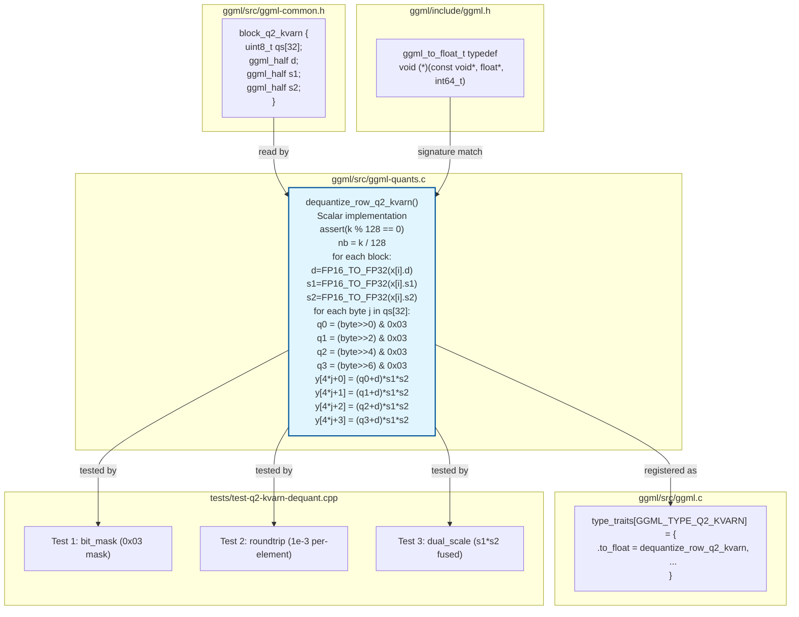

### File Ownership

| File | Role | Changes needed |
|------|------|----------------|
| `ggml/src/ggml-quants.c` | Dequant implementation | Fix `& 0x01` -> `& 0x03` at line 503 |
| `ggml/src/ggml.c` | Type traits registration | Already done (Item 01) |
| `ggml/src/ggml-common.h` | Block struct definition | Already done (Item 01) |
| `tests/test-q2-kvarn-dequant.cpp` | Dequant tolerance tests | Tests 1-4: bit_mask, roundtrip, dual_scale, block_size |

### Registration Chain

```
ggml_type_traits[GGML_TYPE_Q2_KVARN].to_float
    |
    v
dequantize_row_q2_kvarn(x, y, k)
    |
    | called by:
    v
ggml_compute_forward_dup (CPU backend)
ggml_compute_forward_get_rows (CPU backend)
ggml_compute_forward_cpy (CPU backend)
Any backend that calls to_float for type conversion
```

### No SIMD (by design)

The codebase convention is **scalar dequant + SIMD dot product**. No existing type has a SIMD dequant path. SIMD for Q2_KVARN would go in:
- `ggml-cpu/arch/x86/quants.c` (AVX2/AVX512)
- `ggml-cpu/arch/arm/quants.c` (NEON)

But this is deferred -- the scalar implementation satisfies the functional requirement.
