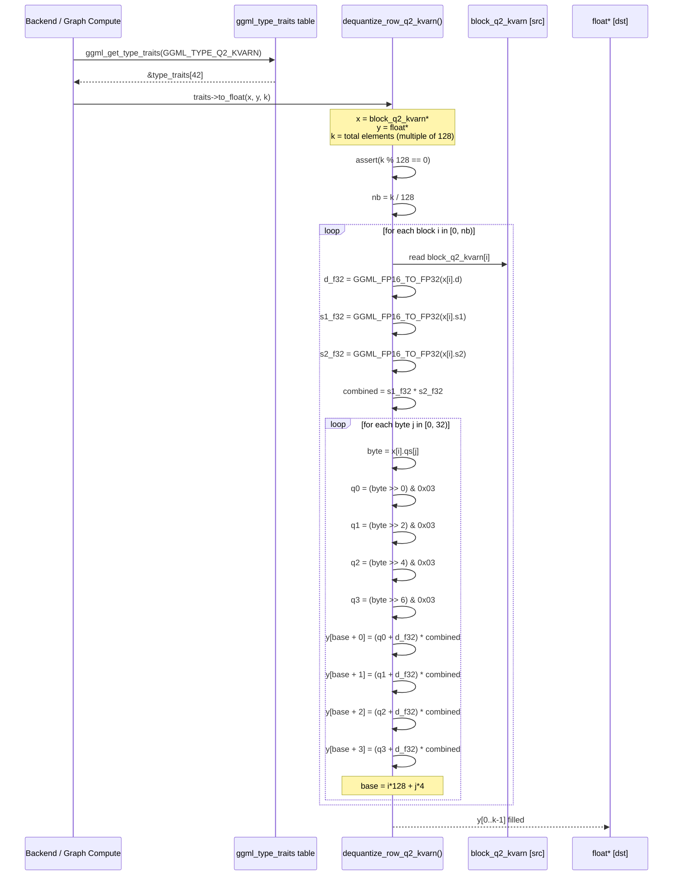
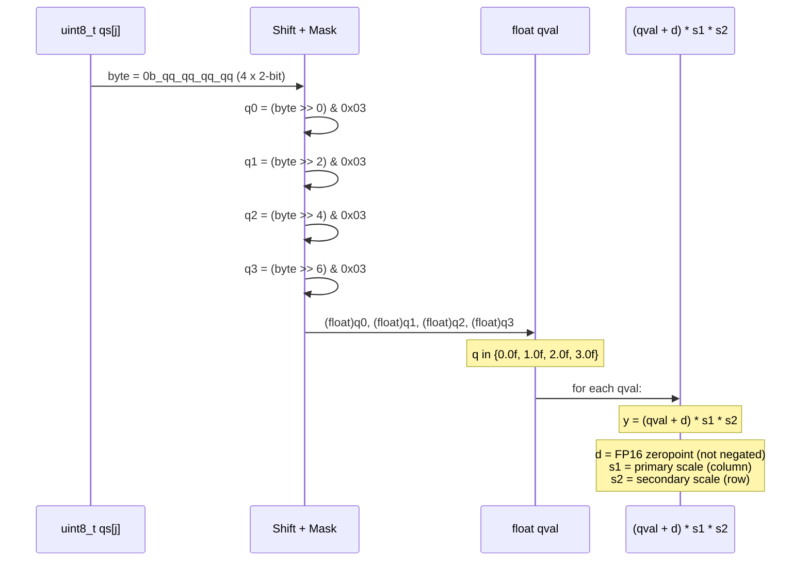
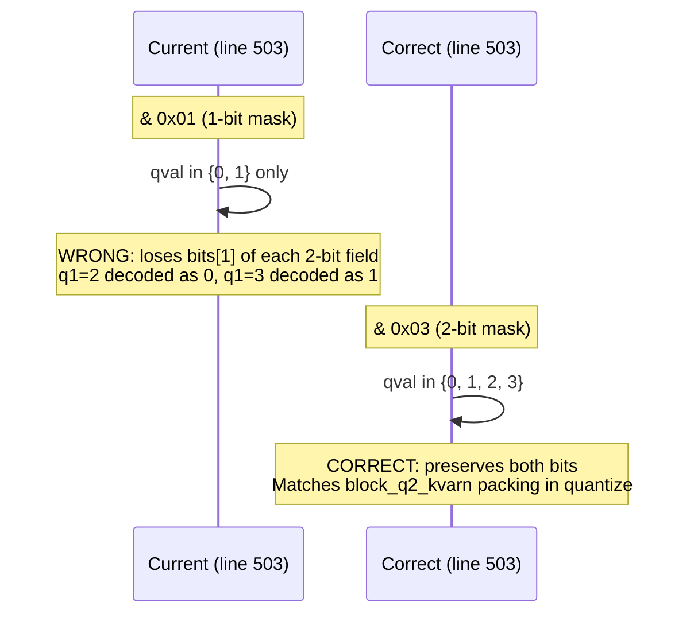

# 1. Dequantize Dispatch (caller -> kernel)

```mermaid
sequenceDiagram
    participant Caller as Backend / Graph Compute
    participant Traits as ggml_type_traits table
    participant DQ as dequantize_row_q2_kvarn()
    participant Block as block_q2_kvarn [src]
    participant Output as float* [dst]

    Caller->>Traits: ggml_get_type_traits(GGML_TYPE_Q2_KVARN)
    Traits-->>Caller: &type_traits[42]

    Caller->>DQ: traits->to_float(x, y, k)
    Note over DQ: x = block_q2_kvarn*<br/>y = float*<br/>k = total elements (multiple of 128)

    DQ->>DQ: assert(k % 128 == 0)
    DQ->>DQ: nb = k / 128

    loop for each block i in [0, nb)
        DQ->>Block: read block_q2_kvarn[i]
        DQ->>DQ: d_f32  = GGML_FP16_TO_FP32(x[i].d)
        DQ->>DQ: s1_f32 = GGML_FP16_TO_FP32(x[i].s1)
        DQ->>DQ: s2_f32 = GGML_FP16_TO_FP32(x[i].s2)
        DQ->>DQ: combined = s1_f32 * s2_f32

        loop for each byte j in [0, 32)
            DQ->>DQ: byte = x[i].qs[j]
            DQ->>DQ: q0 = (byte >> 0) & 0x03
            DQ->>DQ: q1 = (byte >> 2) & 0x03
            DQ->>DQ: q2 = (byte >> 4) & 0x03
            DQ->>DQ: q3 = (byte >> 6) & 0x03

            DQ->>DQ: y[base + 0] = (q0 + d_f32) * combined
            DQ->>DQ: y[base + 1] = (q1 + d_f32) * combined
            DQ->>DQ: y[base + 2] = (q2 + d_f32) * combined
            DQ->>DQ: y[base + 3] = (q3 + d_f32) * combined
            Note over DQ: base = i*128 + j*4
        end
    end

    DQ-->>Output: y[0..k-1] filled
```

# 2. Byte Unpack Detail (one byte)

```mermaid
sequenceDiagram
    participant Byte as uint8_t qs[j]
    participant Shift as Shift + Mask
    participant Float as float qval
    participant Formula as (qval + d) * s1 * s2

    Byte->>Shift: byte = 0b_qq_qq_qq_qq  (4 x 2-bit)
    Shift->>Shift: q0 = (byte >> 0) & 0x03
    Shift->>Shift: q1 = (byte >> 2) & 0x03
    Shift->>Shift: q2 = (byte >> 4) & 0x03
    Shift->>Shift: q3 = (byte >> 6) & 0x03

    Shift->>Float: (float)q0, (float)q1, (float)q2, (float)q3
    Note over Float: q in {0.0f, 1.0f, 2.0f, 3.0f}

    Float->>Formula: for each qval:
    Note over Formula: y = (qval + d) * s1 * s2
    Note over Formula: d  = FP16 zeropoint (not negated)<br/>s1 = primary scale (column)<br/>s2 = secondary scale (row)
```

# 3. Bug Fix: 0x01 -> 0x03

```mermaid
sequenceDiagram
    participant Bug as Current (line 503)
    participant Fix as Correct (line 503)

    Note over Bug: & 0x01  (1-bit mask)
    Bug->>Bug: qval in {0, 1} only
    Note over Bug: WRONG: loses bits[1] of each 2-bit field<br/>q1=2 decoded as 0, q1=3 decoded as 1

    Note over Fix: & 0x03  (2-bit mask)
    Fix->>Fix: qval in {0, 1, 2, 3}
    Note over Fix: CORRECT: preserves both bits<br/>Matches block_q2_kvarn packing in quantize
```
