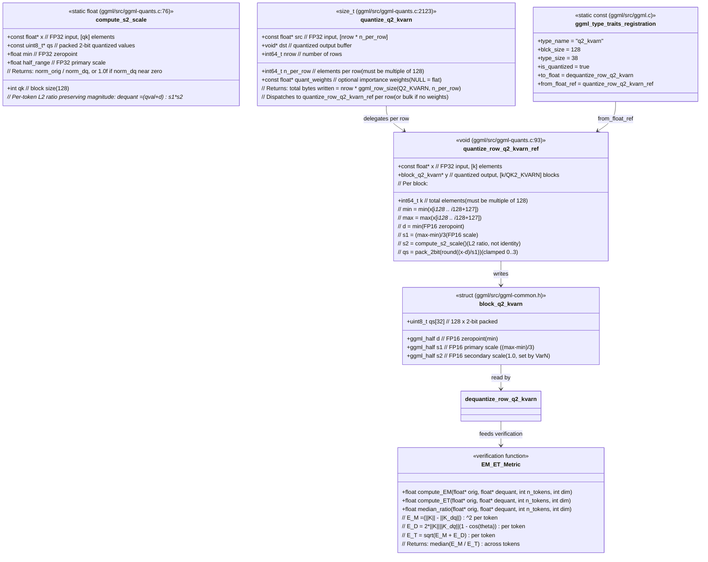

### Data Flow

```
FP32 src [nrow x n_per_row]
    |
    | quantize_q2_kvarn()
    |   |-- quantize_row_q2_kvarn_ref() per block
    v
block_q2_kvarn[]  (38 bytes per 128 elements)
    |
    | dequantize_row_q2_kvarn()
    v
FP32 dst_f32 [nrow x n_per_row]
    |
    | EM_ET_Metric::median_ratio()
    v
E_M/E_T ratio  (must be < 0.5 for median token)
```
