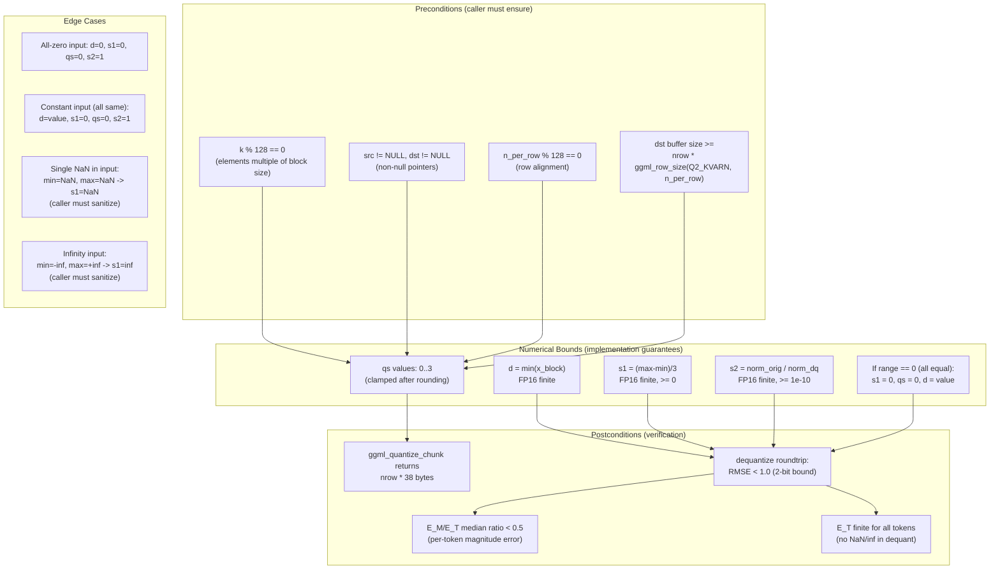

### Safety Contract Summary

| Condition | Assertion | Location |
|-----------|-----------|----------|
| Block alignment | `assert(k % qk == 0)` | `quantize_row_q2_kvarn_ref:77` |
| qs range | Clamped to `[0, 3]` | `quantize_row_q2_kvarn_ref:109-110` |
| s1 non-negative | `half_range = (max-min)/3 >= 0` | `quantize_row_q2_kvarn_ref:92` |
| s2 identity | `norm_orig / norm_dq` (or `1.0f` if `norm_dq < 1e-10`) | `compute_s2_scale:90` |
| Zero range | `inv_d = 1.0f` when `half_range == 0` | `quantize_row_q2_kvarn_ref:112` |
| RMSE bound | `< 1.0` for 2-bit | `test-q2-kvarn-type.cpp:115` |
| E_M/E_T median | `< 0.5` | Test 6 (NEW) |

### E_M/E_T Threshold Rationale

Per `.ai/research/kvarn/02-error-decomposition.md`:
- E_M/E_T > 0.5 means magnitude error dominates total error for that token
- The median token should have E_M/E_T < 0.5, meaning directional error is the larger component
- This is the expected behavior for a well-calibrated quantizer: most tokens have small magnitude error, and the dominant error is angular noise from rounding
- If the median E_M/E_T >= 0.5, the quantizer is systematically mis-scaling tokens (s1/s2 are wrong)
