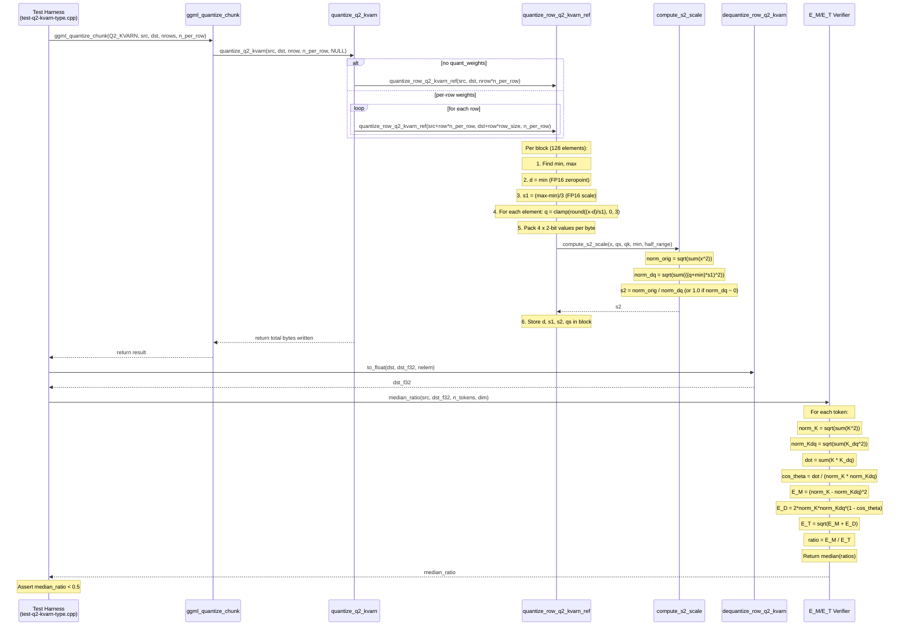

```mermaid
sequenceDiagram
    participant T as Test Harness<br/>(test-q2-kvarn-type.cpp)
    participant QC as ggml_quantize_chunk
    participant Q as quantize_q2_kvarn
    participant QR as quantize_row_q2_kvarn_ref
    participant S2 as compute_s2_scale
    participant DQ as dequantize_row_q2_kvarn
    participant EM as E_M/E_T Verifier

    T->>QC: ggml_quantize_chunk(Q2_KVARN, src, dst, nrows, n_per_row)
    QC->>Q: quantize_q2_kvarn(src, dst, nrow, n_per_row, NULL)

    alt no quant_weights
        Q->>QR: quantize_row_q2_kvarn_ref(src, dst, nrow*n_per_row)
    else per-row weights
        loop for each row
            Q->>QR: quantize_row_q2_kvarn_ref(src+row*n_per_row, dst+row*row_size, n_per_row)
        end
    end

    Note over QR: Per block (128 elements):
    Note over QR: 1. Find min, max
    Note over QR: 2. d = min (FP16 zeropoint)
    Note over QR: 3. s1 = (max-min)/3 (FP16 scale)
    Note over QR: 4. For each element: q = clamp(round((x-d)/s1), 0, 3)
    Note over QR: 5. Pack 4 x 2-bit values per byte
    QR->>S2: compute_s2_scale(x, qs, qk, min, half_range)
    Note over S2: norm_orig = sqrt(sum(x^2))
    Note over S2: norm_dq = sqrt(sum(((q+min)*s1)^2))
    Note over S2: s2 = norm_orig / norm_dq (or 1.0 if norm_dq ~ 0)
    S2-->>QR: s2
    Note over QR: 6. Store d, s1, s2, qs in block

    Q-->>QC: return total bytes written
    QC-->>T: return result

    T->>DQ: to_float(dst, dst_f32, nelem)
    DQ-->>T: dst_f32

    T->>EM: median_ratio(src, dst_f32, n_tokens, dim)
    Note over EM: For each token:
    Note over EM:   norm_K = sqrt(sum(K^2))
    Note over EM:   norm_Kdq = sqrt(sum(K_dq^2))
    Note over EM:   dot = sum(K * K_dq)
    Note over EM:   cos_theta = dot / (norm_K * norm_Kdq)
    Note over EM:   E_M = (norm_K - norm_Kdq)^2
    Note over EM:   E_D = 2*norm_K*norm_Kdq*(1 - cos_theta)
    Note over EM:   E_T = sqrt(E_M + E_D)
    Note over EM:   ratio = E_M / E_T
    Note over EM: Return median(ratios)
    EM-->>T: median_ratio

    Note over T: Assert median_ratio < 0.5
```
