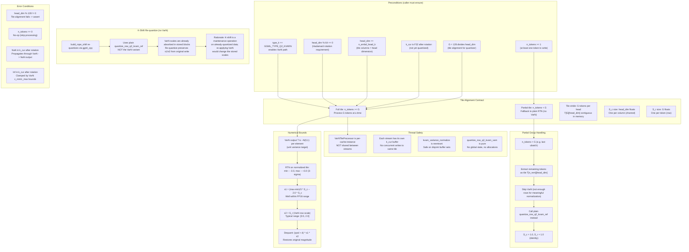

### Safety Contract Summary

| Condition | Assertion | Location |
|-----------|-----------|----------|
| Type check | `GGML_ASSERT(type_k == GGML_TYPE_Q2_KVARN)` | `VarNTileProcessor` entry |
| Head dim alignment | `GGML_ASSERT(head_dim % 128 == 0)` | Tile extraction |
| Tile size | `GGML_ASSERT(G == 128)` | Compile-time constant |
| Buffer ownership | Caller owns k_cur data; tile_buf is stack/scratch | `VarNTileProcessor` |
| Partial group | `if (n_remaining < G) { fallback_to_plain_rtn(); }` | `process_partial()` |
| K-shift re-quantize | Uses `quantize_row_q2_kvarn_ref` (no VarN) | `build_rope_shift` |
| Thread safety | No global state; per-instance scratch buffers | All functions |
| NaN propagation | Not detected; caller should sanitize if needed | All functions |

### Key Design Decisions

1. **VarN runs on CPU, not in graph**: The VarN normalization is a CPU-side pre-processing step that runs inside `cpy_k()` before `ggml_set_rows`. This avoids adding new graph ops and keeps the GPU backend path unchanged.

2. **New quantizer variant**: `quantize_row_q2_kvarn_varn` accepts external `S_c` and `S_r` vectors. It does NOT compute its own L2 ratio s2 — instead it uses `S_r` directly. The primary scale `s1` is computed as `(max-min)/3 * S_c[block]`.

3. **K-shift does NOT re-apply VarN**: When the cache is shifted (context shift), the re-quantization uses the plain `quantize_row_q2_kvarn_ref`. The VarN scales are already absorbed into the stored `s1`/`s2` fields, so re-quantization preserves them. Re-applying VarN during shift would be incorrect because the tile structure changes.

4. **Partial groups skip VarN**: When fewer than G=128 tokens are available (e.g., last ubatch in a decode step), VarN is skipped and plain RTN quantization is used. This is acceptable because:
   - Partial groups are rare (only at the end of a batch)
   - The magnitude error from a single partial group is negligible
   - VarN requires a full tile for meaningful row/column statistics

5. **Scratch buffer allocation**: `VarNTileProcessor` allocates its tile buffer (`G * head_dim` floats) once during cache construction, not per-call. This avoids repeated allocation overhead.
