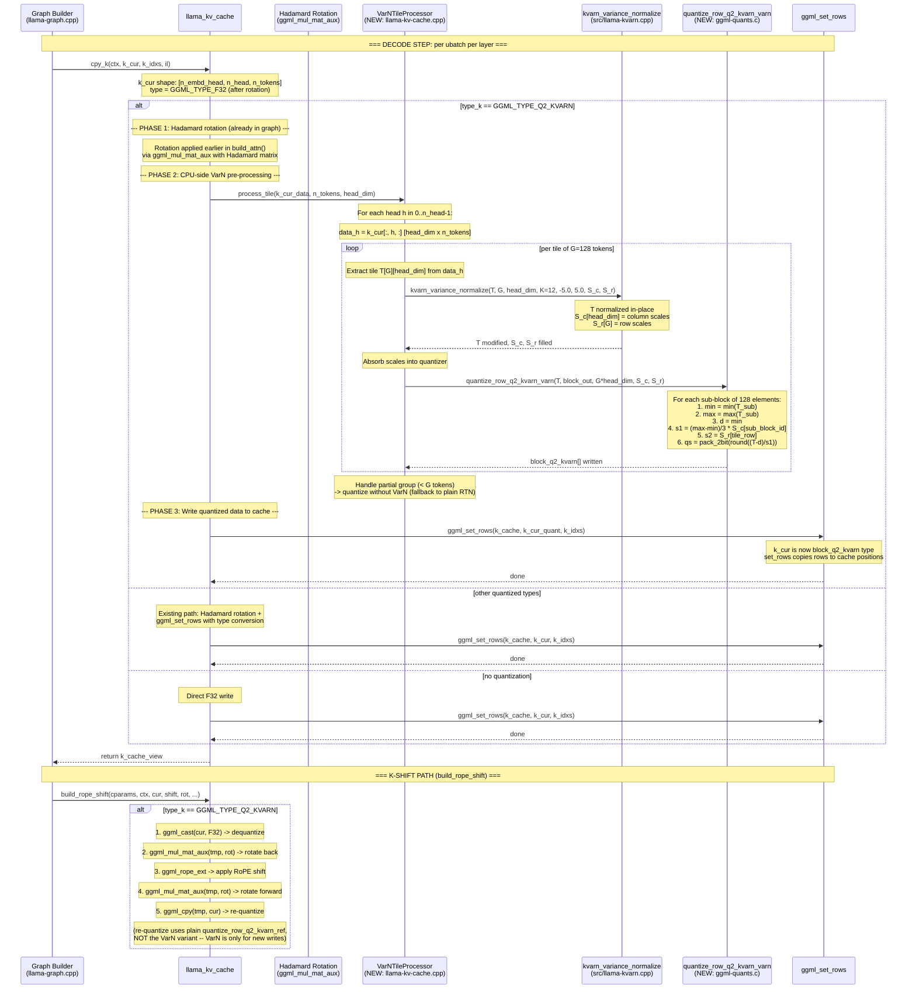

```mermaid
sequenceDiagram
    participant G as Graph Builder<br/>(llama-graph.cpp)
    participant KC as llama_kv_cache
    participant HR as Hadamard Rotation<br/>(ggml_mul_mat_aux)
    participant VT as VarNTileProcessor<br/>(NEW: llama-kv-cache.cpp)
    participant VN as kvarn_variance_normalize<br/>(src/llama-kvarn.cpp)
    participant QV as quantize_row_q2_kvarn_varn<br/>(NEW: ggml-quants.c)
    participant SR as ggml_set_rows

    Note over G,SR: === DECODE STEP: per ubatch per layer ===

    G->>KC: cpy_k(ctx, k_cur, k_idxs, il)

    Note over KC: k_cur shape: [n_embd_head, n_head, n_tokens]<br/>type = GGML_TYPE_F32 (after rotation)

    alt type_k == GGML_TYPE_Q2_KVARN
        Note over KC: --- PHASE 1: Hadamard rotation (already in graph) ---
        Note over KC: Rotation applied earlier in build_attn()<br/>via ggml_mul_mat_aux with Hadamard matrix

        Note over KC: --- PHASE 2: CPU-side VarN pre-processing ---
        KC->>VT: process_tile(k_cur_data, n_tokens, head_dim)

        Note over VT: For each head h in 0..n_head-1:
        Note over VT:   data_h = k_cur[:, h, :]  [head_dim x n_tokens]

        loop per tile of G=128 tokens
            Note over VT: Extract tile T[G][head_dim] from data_h
            VT->>VN: kvarn_variance_normalize(T, G, head_dim, K=12, -5.0, 5.0, S_c, S_r)
            Note over VN: T normalized in-place<br/>S_c[head_dim] = column scales<br/>S_r[G] = row scales
            VN-->>VT: T modified, S_c, S_r filled

            Note over VT: Absorb scales into quantizer
            VT->>QV: quantize_row_q2_kvarn_varn(T, block_out, G*head_dim, S_c, S_r)
            Note over QV: For each sub-block of 128 elements:<br/>  1. min = min(T_sub)<br/>  2. max = max(T_sub)<br/>  3. d = min<br/>  4. s1 = (max-min)/3 * S_c[sub_block_id]<br/>  5. s2 = S_r[tile_row]<br/>  6. qs = pack_2bit(round((T-d)/s1))
            QV-->>VT: block_q2_kvarn[] written
        end

        Note over VT: Handle partial group (< G tokens)<br/>  -> quantize without VarN (fallback to plain RTN)

        Note over KC: --- PHASE 3: Write quantized data to cache ---
        KC->>SR: ggml_set_rows(k_cache, k_cur_quant, k_idxs)
        Note over SR: k_cur is now block_q2_kvarn type<br/>set_rows copies rows to cache positions
        SR-->>KC: done

    else other quantized types
        Note over KC: Existing path: Hadamard rotation +<br/>ggml_set_rows with type conversion
        KC->>SR: ggml_set_rows(k_cache, k_cur, k_idxs)
        SR-->>KC: done
    else no quantization
        Note over KC: Direct F32 write
        KC->>SR: ggml_set_rows(k_cache, k_cur, k_idxs)
        SR-->>KC: done
    end

    KC-->>G: return k_cache_view

    Note over G,SR: === K-SHIFT PATH (build_rope_shift) ===

    G->>KC: build_rope_shift(cparams, ctx, cur, shift, rot, ...)

    alt type_k == GGML_TYPE_Q2_KVARN
        Note over KC: 1. ggml_cast(cur, F32) -> dequantize
        Note over KC: 2. ggml_mul_mat_aux(tmp, rot) -> rotate back
        Note over KC: 3. ggml_rope_ext -> apply RoPE shift
        Note over KC: 4. ggml_mul_mat_aux(tmp, rot) -> rotate forward
        Note over KC: 5. ggml_cpy(tmp, cur) -> re-quantize
        Note over KC:   (re-quantize uses plain quantize_row_q2_kvarn_ref,<br/>    NOT the VarN variant -- VarN is only for new writes)
    end
```
