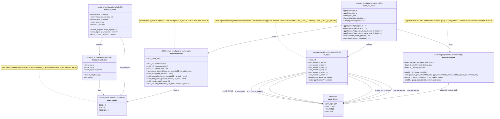

```mermaid
classDiagram

    class llama_kv_cell_ext {
        <<existing (src/llama-kv-cells.h:13)>>
        +llama_pos x
        +llama_pos y
        +kvarn_region region          <<NEW>>
        +bool is_2d_gt(ox, oy)
        +void reset()
    }

    class kvarn_region {
        <<enum (NEW: src/llama-kv-cells.h)>>
        SINK    = 0
        BODY    = 1
        RECENT  = 2
    }

    class llama_kv_cells {
        <<existing (src/llama-kv-cells.h:32)>>
        +vector~llama_pos~ pos
        +vector~llama_kv_cell_ext~ ext
        +vector~llama_pos~ shift
        +vector~bitset~ seq
        +set~uint32_t~ used
        +void set_region(i, kvarn_region)   <<NEW>>
        +kvarn_region get_region(i) const    <<NEW>>
        +uint32_t count_region(r) const      <<NEW>>
    }

    class kv_layer {
        <<existing (src/llama-kv-cache.h:221)>>
        +uint32_t il
        +ggml_tensor* k_sink                <<NEW>>
        +ggml_tensor* v_sink                <<NEW>>
        +ggml_tensor* k_body                <<NEW>>
        +ggml_tensor* v_body                <<NEW>>
        +ggml_tensor* k_recent              <<NEW>>
        +ggml_tensor* v_recent              <<NEW>>
        +vector~ggml_tensor*~ k_stream
        +vector~ggml_tensor*~ v_stream
    }

    class RegionClassifier {
        <<NEW helper (src/llama-kv-cache.cpp)>>
        +uint32_t S                         // sink size (128)
        +uint32_t R                         // recent size (128)
        +uint32_t G                         // group size (128)
        +uint32_t total_cells
        +kvarn_region classify(llama_pos pos, uint32_t n_total) const
        +bool is_sink(llama_pos pos) const
        +bool is_recent(llama_pos pos, uint32_t n_total) const
        +bool is_body(llama_pos pos, uint32_t n_total) const
        +uint32_t body_start() const        // S
        +uint32_t recent_start(uint32_t n_total) const  // n_total - R
    }

    class GroupQuantizer {
        <<NEW helper (src/llama-kv-cache.cpp)>>
        +uint32_t G                         // group size (128)
        +float* tile_buf                    // [G * head_dim] scratch
        +float* S_c_buf                     // [head_dim] scratch
        +float* S_r_buf                     // [G] scratch
        +void quantize_group(float* f32_data, ggml_tensor* body_tensor, uint32_t group_idx, int head_dim)
        +bool is_group_complete(uint32_t n_recent) const
        +uint32_t group_index(uint32_t token_idx) const
    }

    class llama_kv_cache {
        <<existing (src/llama-kv-cache.h:20)>>
        +ggml_type type_k
        +ggml_type type_v
        +uint32_t kv_size
        +RegionClassifier classifier          <<NEW>>
        +GroupQuantizer grouper               <<NEW>>
        +ggml_tensor* get_k(ctx, il)          <<MODIFIED: returns region-aware view>>
        +ggml_tensor* get_v(ctx, il)          <<MODIFIED>>
        +ggml_tensor* cpy_k(ctx, k_cur, k_idxs, il, sinfo)  <<MODIFIED>>
        +ggml_tensor* cpy_v(ctx, v_cur, v_idxs, il, sinfo)  <<MODIFIED>>
        +void quantize_recent_group(il)       <<NEW>>
        +void rebuild_region_metadata()       <<NEW>>
    }

    class ggml_tensor {
        <<existing>>
        +ggml_type type
        +int64_t ne[4]
        +size_t nb[4]
        +void* data
    }

    llama_kv_cell_ext --> kvarn_region : uses
    llama_kv_cells --> llama_kv_cell_ext : contains
    llama_kv_cells --> kvarn_region : set/get region
    llama_kv_cache --> kv_layer : contains
    llama_kv_cache --> RegionClassifier : owns
    llama_kv_cache --> GroupQuantizer : owns
    kv_layer --> ggml_tensor : k_sink (FP16)
    kv_layer --> ggml_tensor : v_sink (FP16)
    kv_layer --> ggml_tensor : k_body (Q2_KVARN)
    kv_layer --> ggml_tensor : v_body (Q2_KVARN)
    kv_layer --> ggml_tensor : k_recent (FP16)
    kv_layer --> ggml_tensor : v_recent (FP16)
    GroupQuantizer --> ggml_tensor : writes to k_body/v_body
    RegionClassifier --> kvarn_region : returns

    note for kvarn_region "SINK = first S tokens (FP16)\nBODY = middle tokens (Q2_KVARN)\nRECENT = last R tokens (FP16)"
    note for RegionClassifier "classify(pos, n_total):\n  if pos < S          -> SINK\n  if pos >= n_total-R  -> RECENT\n  else                 -> BODY"
    note for GroupQuantizer "Triggered when RECENT tokens\nfill a complete group of G.\nQuantizes G tokens at once\nand moves them to BODY."
    note for kv_layer "Three separate tensors per layer\ninstead of one. Each has its own\ntype and backend buffer.\nSink/Recent: GGML_TYPE_F16\nBody: GGML_TYPE_Q2_KVARN"
```
