```mermaid
graph TD
    subgraph "Preconditions (caller must ensure)"
        P1["type_k == GGML_TYPE_Q2_KVARN<br/>enables three-region layout"]
        P2["kv_size > S + R<br/>(at least one body cell)"]
        P3["S >= G and R >= G<br/>(regions align with group size)"]
        P4["S > 0 and R > 0<br/>(sink and recent must exist)"]
        P5["G == 128 (compile-time constant)"]
        P6["head_dim % 64 == 0<br/>(Hadamard rotation requirement)"]
    end

    subgraph "Region Boundary Invariants"
        B1["Sink region: cells [0, S-1]<br/>Always FP16, never quantized"]
        B2["Body region: cells [S, kv_size-R-1]<br/>Always Q2_KVARN, never FP16"]
        B3["Recent region: cells [kv_size-R, kv_size-1]<br/>Always FP16, never quantized"]
        B4["A cell's region NEVER changes<br/>after initial allocation"]
        B5["Exception: recent->body transition<br/>when a group of G recent tokens<br/>is quantized and moved"]
    end

    subgraph "Recent-to-Body Transition Contract"
        T1["Trigger: n_recent_tokens >= G<br/>after a write to recent region"]
        T2["Action: read G FP16 tokens from k_recent<br/>-> convert to F32 -> VarN -> quantize -> write to k_body"]
        T3["Cell metadata: update region from RECENT to BODY<br/>for the G cells being moved"]
        T4["The G cells remain at their original indices<br/>Only the storage type and metadata change"]
        T5["Partial group (< G tokens) stays in RECENT<br/>until next write fills the group"]
    end

    subgraph "Attention Read Contract"
        A1["get_k(ctx, il) returns a view spanning<br/>all three regions with mixed types"]
        A2["Sink/recent cells read as FP16<br/>(no dequantization needed)"]
        A3["Body cells read as Q2_KVARN<br/>(dequantized on-the-fly by attention kernel)"]
        A4["Attention mask must span all regions<br/>contiguously (no gaps)"]
        A5["K-shift on sink/recent: in-place RoPE on FP16<br/>K-shift on body: dequant -> rotate -> re-quantize"]
    end

    subgraph "Thread Safety"
        S1["RegionClassifier is stateless (const methods)<br/>Safe to call from any thread"]
        S2["GroupQuantizer owns scratch buffers<br/>Per-cache-instance, NOT shared between streams"]
        S3["recent->body transition is serialized<br/>within a single cpy_k() call"]
        S4["No concurrent writes to same cell<br/>(enforced by find_slot/apply_ubatch)"]
    end

    subgraph "Error Conditions"
        E1["kv_size <= S + R<br/>-> body region is empty<br/>-> fallback: all FP16 (no quantization)"]
        E2["S % G != 0 or R % G != 0<br/>-> region boundaries misaligned<br/>-> assert at cache construction"]
        E3["find_slot crosses region boundary<br/>-> slot must be within a single region<br/>-> split into multiple slots if needed"]
        E4["seq_cp copies across region boundary<br/>-> must copy tensor data + update region metadata<br/>-> assert if source/dest regions differ"]
        E5["State save/restore with mixed regions<br/>-> must save/restore all three tensors<br/>-> region metadata must be part of cell state"]
    end

    subgraph "Numerical Guarantees"
        N1["Sink tokens: full FP16 precision<br/>Preserves attention-sink behavior"]
        N2["Recent tokens: full FP16 precision<br/>No quantization error on fresh tokens"]
        N3["Body tokens: Q2_KVARN with VarN<br/>KL-divergence < 0.1 vs FP16 baseline"]
        N4["recent->body transition is lossy<br/>(quantization happens once, never undone)"]
        N5["K-shift on body: re-quantize preserves<br/>existing s1/s2 scales (no VarN re-apply)"]
    end

    P1 --> B1
    P2 --> B2
    P3 --> B3
    P4 --> B4
    P5 --> T1
    P6 --> A1
    B4 --> T1
    T1 --> T2
    T2 --> T3
    T3 --> T4
    T4 --> T5
    B1 --> A1
    B2 --> A2
    B3 --> A3
    A1 --> A4
    A4 --> A5
    B1 --> S1
    B2 --> S2
    B3 --> S3
    T2 --> S4
    E1 --> N1
    E2 --> N2
    E3 --> N3
    E4 --> N4
    E5 --> N5
```

### Safety Contract Summary

| Condition | Assertion | Location |
|-----------|-----------|----------|
| Type check | `GGML_ASSERT(type_k == GGML_TYPE_Q2_KVARN)` | `llama_kv_cache` constructor |
| Min size | `GGML_ASSERT(kv_size > S + R)` | Constructor |
| Alignment | `GGML_ASSERT(S % G == 0 && R % G == 0)` | Constructor |
| Region bounds | `GGML_ASSERT(idx < S \|\| (idx >= S && idx < kv_size-R) \|\| idx >= kv_size-R)` | `set_region()` |
| No cross-region slot | `GGML_ASSERT(all same region)` | `find_slot()` |
| Group complete | `GGML_ASSERT(n_recent >= G)` | `quantize_group()` |
| K-shift body only | `GGML_ASSERT(region == BODY)` | `build_rope_shift` dequant path |
| State save/restore | Save all 3 tensors + region metadata | `llama_state_*` API |

### Key Design Decisions

1. **Three separate tensors, not one with views**: Each region gets its own `ggml_tensor` with the correct type. This lets `ggml_set_rows` handle type conversion automatically (FP16 for sink/recent, Q2_KVARN for body). The alternative — one tensor with views — would require manual type management.

2. **Region is a cell property, not a tensor property**: The `region` field lives in `llama_kv_cell_ext` alongside `x`/`y`. This allows cells to transition from RECENT to BODY when a group is quantized. The tensor identity is derived from the cell's region, not the other way around.

3. **recent->body transition is batched**: A full group of G tokens is quantized atomically. Partial groups stay in FP16. This avoids the complexity of partially-quantized groups and matches the paper's design (Appendix D).

4. **find_slot must not cross region boundaries**: A slot (contiguous run of cells for a ubatch) must lie entirely within one region. If the ubatch spans a region boundary, it is split into multiple slots. This keeps the tensor write path simple (one `ggml_set_rows` call per tensor type).

5. **K-shift on sink/recent is in-place FP16**: No dequant/re-quant cycle needed. Only the body region goes through the full dequant -> rotate -> re-quantize path. This is a performance win since sink/recent are typically small (128 tokens each).

6. **State save/restore must handle three tensors**: The existing `llama_state_*` API assumes one K/V tensor per layer. The three-region layout requires saving/restoring all three tensors plus the per-cell region metadata. This is the most invasive change to the existing code.
