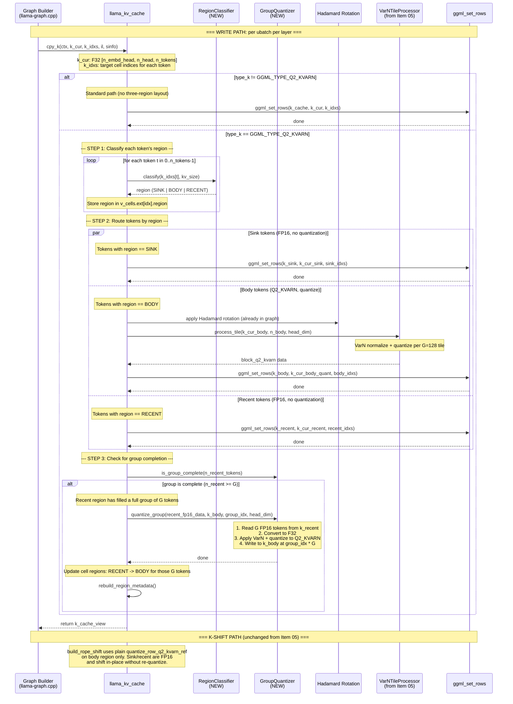

```mermaid
sequenceDiagram
    participant GB as Graph Builder<br/>(llama-graph.cpp)
    participant KC as llama_kv_cache
    participant RC as RegionClassifier<br/>(NEW)
    participant GQ as GroupQuantizer<br/>(NEW)
    participant HR as Hadamard Rotation
    participant VN as VarNTileProcessor<br/>(from Item 05)
    participant SR as ggml_set_rows

    Note over GB,SR: === WRITE PATH: per ubatch per layer ===

    GB->>KC: cpy_k(ctx, k_cur, k_idxs, il, sinfo)

    Note over KC: k_cur: F32 [n_embd_head, n_head, n_tokens]<br/>k_idxs: target cell indices for each token

    alt type_k != GGML_TYPE_Q2_KVARN
        Note over KC: Standard path (no three-region layout)
        KC->>SR: ggml_set_rows(k_cache, k_cur, k_idxs)
        SR-->>KC: done
    else type_k == GGML_TYPE_Q2_KVARN
        Note over KC: --- STEP 1: Classify each token's region ---
        loop for each token t in 0..n_tokens-1
            KC->>RC: classify(k_idxs[t], kv_size)
            RC-->>KC: region (SINK | BODY | RECENT)
            Note over KC: Store region in v_cells.ext[idx].region
        end

        Note over KC: --- STEP 2: Route tokens by region ---

        par Sink tokens (FP16, no quantization)
            Note over KC: Tokens with region == SINK
            KC->>SR: ggml_set_rows(k_sink, k_cur_sink, sink_idxs)
            SR-->>KC: done
        and Body tokens (Q2_KVARN, quantize)
            Note over KC: Tokens with region == BODY
            KC->>HR: apply Hadamard rotation (already in graph)
            KC->>VN: process_tile(k_cur_body, n_body, head_dim)
            Note over VN: VarN normalize + quantize per G=128 tile
            VN-->>KC: block_q2_kvarn data
            KC->>SR: ggml_set_rows(k_body, k_cur_body_quant, body_idxs)
            SR-->>KC: done
        and Recent tokens (FP16, no quantization)
            Note over KC: Tokens with region == RECENT
            KC->>SR: ggml_set_rows(k_recent, k_cur_recent, recent_idxs)
            SR-->>KC: done
        end

        Note over KC: --- STEP 3: Check for group completion ---
        KC->>GQ: is_group_complete(n_recent_tokens)
        alt group is complete (n_recent >= G)
            Note over KC: Recent region has filled a full group of G tokens
            KC->>GQ: quantize_group(recent_fp16_data, k_body, group_idx, head_dim)
            Note over GQ: 1. Read G FP16 tokens from k_recent<br/>2. Convert to F32<br/>3. Apply VarN + quantize to Q2_KVARN<br/>4. Write to k_body at group_idx * G
            GQ-->>KC: done
            Note over KC: Update cell regions: RECENT -> BODY for those G tokens
            KC->>KC: rebuild_region_metadata()
        end
    end

    KC-->>GB: return k_cache_view

    Note over GB,SR: === K-SHIFT PATH (unchanged from Item 05) ===

    Note over KC: build_rope_shift uses plain quantize_row_q2_kvarn_ref<br/>on body region only. Sink/recent are FP16<br/>and shift in-place without re-quantize.
```
