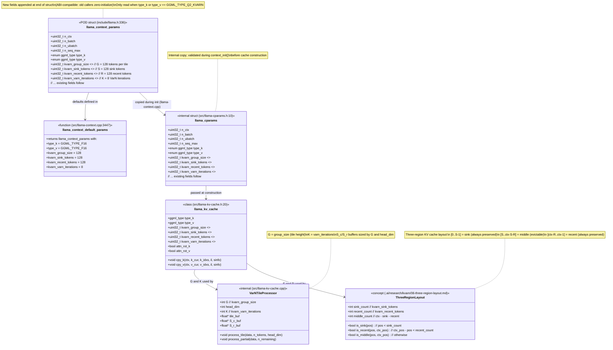

### Default Values

| Field | Default | Rationale |
|-------|---------|-----------|
| `kvarn_group_size` | 128 | Tile size for VarN normalization; matches block size of Q2_KVARN |
| `kvarn_sink_tokens` | 128 | Sink region size; preserves initial tokens from eviction |
| `kvarn_recent_tokens` | 128 | Recent region size; preserves last tokens from eviction |
| `kvarn_varn_iterations` | 8 | VarN convergence iterations; 8 is sufficient for ~N(0,1) |

### Field Semantics

| Field | Type | Range | Meaning |
|-------|------|-------|---------|
| `kvarn_group_size` | `uint32_t` | [1, 1024], must divide `n_embd_head_k` | Number of tokens per VarN tile |
| `kvarn_sink_tokens` | `uint32_t` | [0, n_ctx) | Number of tokens in the sink (always-preserved) region |
| `kvarn_recent_tokens` | `uint32_t` | [0, n_ctx) | Number of tokens in the recent (always-preserved) region |
| `kvarn_varn_iterations` | `uint32_t` | [1, 100] | Number of variance normalization iterations |
