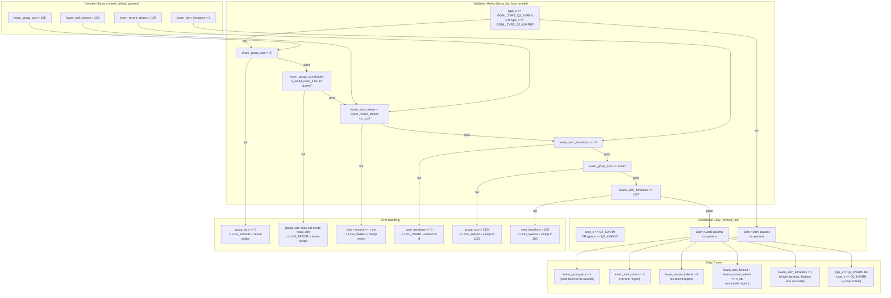

### Validation Table

| # | Rule | Severity | Action | Rationale |
|---|------|----------|--------|-----------|
| 1 | `kvarn_group_size == 0` | **Error** | `return nullptr` | Group size must be positive for tile processing |
| 2 | `kvarn_group_size > n_embd_head_k` | **Error** | `return nullptr` | Tile cannot be larger than head dimension |
| 3 | `n_embd_head_k % kvarn_group_size != 0` | **Error** | `return nullptr` | Group size must divide head dim for tile alignment |
| 4 | `kvarn_group_size > 1024` | Warning | Clamp to 1024 | Practical upper bound; larger tiles waste memory |
| 5 | `kvarn_sink_tokens + kvarn_recent_tokens >= n_ctx` | Warning | Clamp `recent_tokens = n_ctx - sink_tokens - 1` | Must leave at least 1 slot for middle region |
| 6 | `kvarn_varn_iterations == 0` | Warning | Default to 8 | Zero iterations = no normalization |
| 7 | `kvarn_varn_iterations > 100` | Warning | Clamp to 100 | Diminishing returns beyond 100 iterations |
| 8 | `type_k != Q2_KVARN && type_v != Q2_KVARN` | Info | Zero all KVarN cparams | Params are irrelevant; silently ignore |

### Default Value Rationale

| Default | Source | Rationale |
|---------|--------|-----------|
| `G = 128` | Research paper §9 | Matches Q2_KVARN block size; good statistical sample for VarN |
| `S = 128` | Research paper §6 | Preserves ~1 sentence of context from eviction |
| `R = 128` | Research paper §6 | Preserves last ~1 sentence from eviction |
| `K = 8` | Research paper §9 | 8 iterations sufficient for convergence to ~N(0,1) |

### Three-Region Layout Invariants

```
|<- sink (S) ->|<- middle (ctx - S - R) ->|<- recent (R) ->|
+--------------+---------------------------+-----------------+
0              S              ctx-R                      ctx-1
```

- **Sink region** `[0, S)`: Always preserved; never evicted.
- **Recent region** `[ctx-R, ctx)`: Always preserved; never evicted.
- **Middle region** `[S, ctx-R)`: Subject to eviction when cache is full.
- Invariant: `S + R < n_ctx` (enforced by validation rule #5).

### Conditional Copy Logic

```
if (type_k == GGML_TYPE_Q2_KVARN || type_v == GGML_TYPE_Q2_KVARN) {
    cparams.kvarn_group_size      = params.kvarn_group_size;
    cparams.kvarn_sink_tokens     = params.kvarn_sink_tokens;
    cparams.kvarn_recent_tokens   = params.kvarn_recent_tokens;
    cparams.kvarn_varn_iterations = params.kvarn_varn_iterations;
} else {
    cparams.kvarn_group_size      = 0;
    cparams.kvarn_sink_tokens     = 0;
    cparams.kvarn_recent_tokens   = 0;
    cparams.kvarn_varn_iterations = 0;
}
```

This ensures that non-KVarN caches have zeroed KVarN fields, making it safe to check `cparams.kvarn_group_size > 0` as a gate for KVarN-specific code paths.
