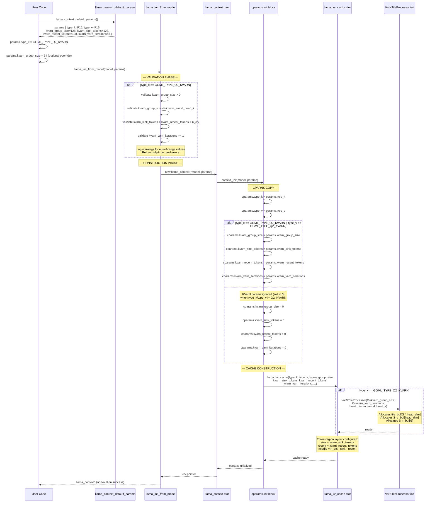

### Init Flow Summary

```
User Code                    llama.cpp Internals
    |                              |
    |-- llama_context_default_params()
    |     returns defaults          |
    |-- set type_k = Q2_KVARN      |
    |-- set kvarn_group_size = 64  |
    |-- llama_init_from_model()    |
    |     |                        |
    |     |-- validate KVarN params|
    |     |-- new llama_context()  |
    |     |     |-- context_init() |
    |     |     |     |-- copy to cparams
    |     |     |     |-- llama_kv_cache ctor
    |     |     |     |     |-- VarNTileProcessor
    |     |     |     |     |-- three-region layout
    |     |     |     |-- return
    |     |     |-- return
    |     |-- return ctx
    v                              v
```

### Key Invariants

1. KVarN params are **only copied to cparams** when `type_k == Q2_KVARN` or `type_v == Q2_KVARN`; otherwise they are zeroed.
2. Validation happens **before** construction; invalid params return `nullptr`.
3. `VarNTileProcessor` is only instantiated when `type_k == Q2_KVARN`.
4. The three-region layout is configured at cache construction time and is immutable for the lifetime of the cache.
