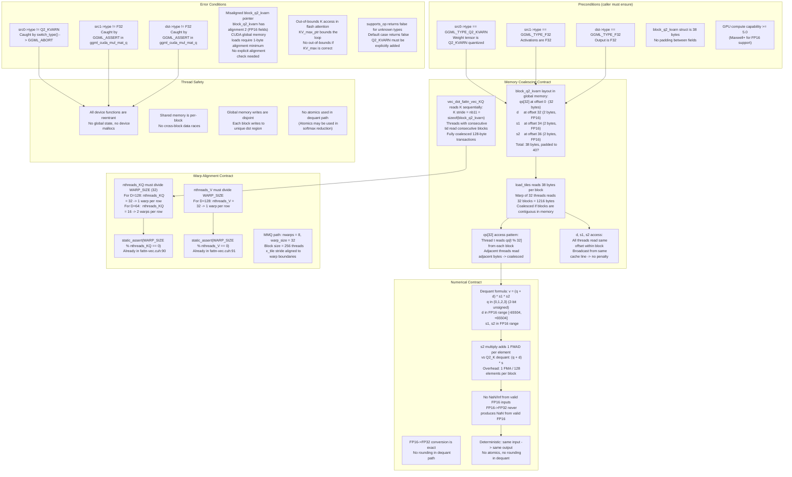

### Safety Contract Summary

| Condition | Assertion / Enforcement | Location | Failure Mode |
|-----------|------------------------|----------|-------------|
| src0 type | `GGML_ASSERT(src0->type == GGML_TYPE_Q2_KVARN)` | `mmq.cu` switch dispatch | `GGML_ABORT` |
| src1 type | `GGML_ASSERT(src1->type == GGML_TYPE_F32)` | `ggml_cuda_mul_mat_q` | `GGML_ABORT` |
| dst type | `GGML_ASSERT(dst->type == GGML_TYPE_F32)` | `ggml_cuda_mul_mat_q` | `GGML_ABORT` |
| Block size | `static_assert(sizeof(block_q2_kvarn) == 38)` | `ggml-common.h:191` | Compile error |
| Warp alignment | `static_assert(WARP_SIZE % nthreads_KQ == 0)` | `fattn-vec.cuh:90` | Compile error |
| Warp alignment | `static_assert(WARP_SIZE % nthreads_V == 0)` | `fattn-vec.cuh:91` | Compile error |
| supports_op | `case GGML_TYPE_Q2_KVARN: return true` | `ggml-cuda.cu:5156-5186` | Falls to CPU fallback |
| Memory coalescing | Contiguous block layout | `kvarn.cuh` load_tiles | Performance degradation |
| No NaN/Inf | FP16->FP32 is exact | `kvarn.cuh` dequant | N/A (guaranteed) |
| Thread safety | No globals, no atomics in dequant | All device functions | Data race (impossible) |

### Overhead Budget

| Component | Instructions | vs Q2_K baseline |
|-----------|-------------|-------------------|
| Unpack 2-bit | 2 shifts + 2 AND | Same |
| Add d | 1 FADD | Same |
| Mul by s1 | 1 FMUL | Same |
| **Mul by s2** | **1 FMUL** | **+1 FMA per element** |
| Total per element | 6 ops | +1 FMA (16.7% more ops) |
| Hides behind memory latency? | Yes | FMA is free when memory-bound |

The extra `* s2` multiply is a single FMA instruction per element. Since the dequant kernel is memory-bound (reading 38 bytes to produce 512 bytes of output), the extra arithmetic is hidden by memory latency. This is why the paper reports <1.4% overhead at short contexts and ~0% at long contexts.

### Key Design Decisions

1. **No separate dequant kernel**: Dequant is fused into `load_tiles` (mmq path) and `vec_dot_KQ` (fattn path). This avoids an extra HBM write of the dequantized tensor.

2. **s2 absorbed in load_tiles**: The `load_tiles_q2_kvarn` function applies `* s2` during the tile load into shared memory. The downstream `vec_dot` functions are identical to Q2_K's -- they operate on already-dequantized values.

3. **Flash attention inline dequant**: The `vec_dot_fattn_vec_KQ_q2_kvarn` function dequantizes K on-the-fly from registers. No shared memory intermediate for K values.

4. **Reuse Q2_K constants**: `VDR_Q2_K_Q8_1_MMQ`, `QR2_K`, `QI2_K` are reused from Q2_K since the block structure is identical (same packing, same 128-element block size).

5. **No FP8 on GPU**: The paper mentions FP8 for s1/s2, but the GPU implementation stores them as FP16 to avoid FP8 conversion overhead on pre-Hopper GPUs. This adds 0.0625 bits/element (total 2.3125 vs 2.25), which is negligible.
