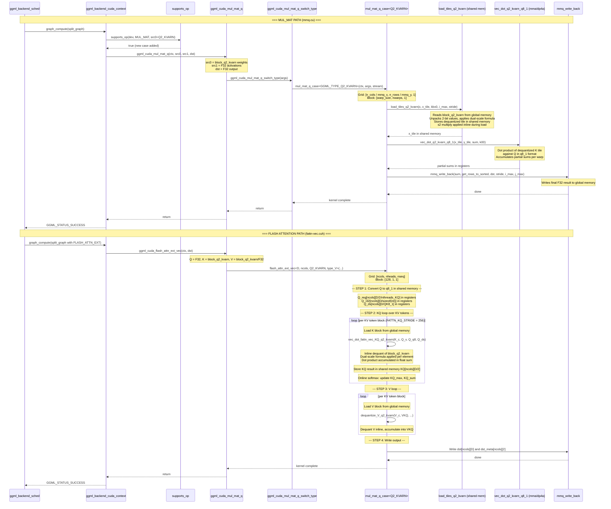

### Launch Configuration Summary

| Path | Kernel | Grid | Block | Shared Mem |
|------|--------|------|-------|------------|
| MUL_MAT (mmq) | `mul_mat_q_case<Q2_KVARN>` | `[n_cols/mmq_x, n_rows/mmq_y, 1]` | `[warp_size, nwarps, 1]` | x_tile + y_tile |
| Flash Attn (fattn-vec) | `flash_attn_ext_vec<D, ncols, Q2_KVARN, V>` | `[ncols, nheads, nseq]` | `[128, 1, 1]` | KQ + VKQ + temp |

### Key Design Points

1. **No separate dequant kernel launch**: Dequant is fused into the load_tiles step (mmq path) or the vec_dot_KQ step (fattn path). This avoids an extra HBM round-trip.

2. **s2 multiply is free**: The extra `* s2` multiply is a single FMAD instruction per element, which is hidden by memory latency. This is why the paper reports <1.4% overhead.

3. **Shared memory tile layout**: For mmq path, the dequantized tile stores values in the same format as Q2_K tiles, with s2 already applied. The vec_dot functions are identical to Q2_K's -- only the load_tiles function differs.

4. **Flash attention path**: The `vec_dot_fattn_vec_KQ_q2_kvarn` function is added to `get_vec_dot_KQ` dispatch. It follows the same pattern as existing `vec_dot_fattn_vec_KQ_q4_0` etc.
