```mermaid
classDiagram

    class PseudoDecodeHarness {
        <<main test class (tests/test-kvarn-pseudo-decode.cpp)>>
        +llama_model* model
        +llama_context* ctx
        +std::vector<llama_token> prompt
        +int block_size                    // b = 128 tokens
        +int n_layers
        +int n_heads
        +int head_dim
        +ggml_type quant_type              // Q2_KVARN or Q4_0 (KIVI baseline)
        +float* baseline_attn_outputs      // [n_layers][n_blocks][n_heads][head_dim]
        +float* eval_attn_outputs          // same shape
        +float* errors                     // [n_layers][n_blocks] RMSE per layer per block
        +void load_model(const char* path)
        +void tokenize_prompt(const char* text)
        +void run_baseline()
        +void run_pseudo_decode()
        +void measure_errors()
        +void report_results()
        +int  main(int argc, char** argv)
    }

    class BlockProcessor {
        <<internal helper>>
        +int block_size                    // G = 128
        +int n_tokens_total
        +int n_blocks
        +int current_block
        +void process_block(llama_context* ctx, int token_start, int token_end, bool quantize_after)
        +bool is_last_block()
    }

    class QuantizeStep {
        <<internal helper>>
        +ggml_type quant_type
        +void quantize_cache(llama_context* ctx, int n_layers)
        +void quantize_layer(llama_kv_cache* cache, int il)
        +bool is_quantized(llama_context* ctx)
    }

    class ErrorMeasurer {
        <<internal helper>>
        +int n_layers
        +int n_heads
        +int head_dim
        +int n_blocks
        +float* baseline                     // reference attention outputs
        +float* evaluated                   // pseudo-decode attention outputs
        +float* layer_errors                // [n_layers][n_blocks] RMSE
        +float* head_errors                 // [n_layers][n_heads][n_blocks] per-head RMSE
        +void compute_layer_rmse(int il, int block_idx)
        +void compute_all_errors()
        +float compute_rmse(float* a, float* b, int n)
    }

    class BaselineRunner {
        <<internal helper>>
        +llama_context* ctx
        +std::vector<llama_token> prompt
        +float* attn_outputs                // [n_layers][n_tokens][n_heads][head_dim]
        +void run_full_precision()
        +void capture_attention_output(int il, int token_idx)
        +void save_baseline()
    }

    class ErrorReporter {
        <<output formatter>>
        +float* layer_errors                // [n_layers][n_blocks]
        +int n_layers
        +int n_blocks
        +int block_size
        +void print_csv(std::FILE* out)
        +void print_summary()
        +void plot_ascii()                  // optional: ASCII art error curve
        +void export_json(const char* path)
    }

    class AttentionOutputHook {
        <<callback / observer>>
        +float* output_buffer              // [n_heads * head_dim] per layer
        +void on_attention_compute(int il, float* output)
        +void reset()
    }

    class ModelLoader {
        <<utility>>
        +llama_model* load(const char* path, ggml_type kv_type)
        +llama_context* create_context(llama_model* model)
        +void set_kv_cache_type(llama_context_params* params, ggml_type type_k, ggml_type type_v)
    }

    PseudoDecodeHarness --> BlockProcessor : creates
    PseudoDecodeHarness --> QuantizeStep : creates
    PseudoDecodeHarness --> ErrorMeasurer : creates
    PseudoDecodeHarness --> BaselineRunner : creates
    PseudoDecodeHarness --> ErrorReporter : creates
    PseudoDecodeHarness --> ModelLoader : creates
    PseudoDecodeHarness --> AttentionOutputHook : creates per layer
    BaselineRunner --> AttentionOutputHook : uses to capture FP16 outputs
    ErrorMeasurer --> AttentionOutputHook : uses to capture eval outputs
    BlockProcessor --> QuantizeStep : calls after each block
    ErrorMeasurer --> ErrorReporter : feeds results

    note for PseudoDecodeHarness "Entry point: main()\n\nCLI args:\n  -m <model.gguf>\n  -p <prompt>\n  -b <block_size> (default 128)\n  -t <quant_type> (default Q2_KVARN)\n  --kivi  (compare against KIVI Q4_0)\n  --csv <output.csv>\n  --json <output.json>\n\nExit criterion:\n  Qwen3-4B, 1000-token wikitext\n  -> monotonically increasing error curve\n  -> KVarN curve lower than KIVI at every ctx length"
    note for ErrorMeasurer "Reconstruction error = RMSE of attention output\nbetween baseline (FP16) and evaluated (quantized)\n\nPer layer, per block:\n  error[il][block] = sqrt(mean((out_baseline - out_eval)^2))\n\nPer head, per block:\n  head_error[il][ih][block] = sqrt(mean((head_out_baseline - head_out_eval)^2))"
    note for AttentionOutputHook "Hooks into llama_decode() output\nCaptures attention output tensor after\nsoftmax but before matmul with V\n\nFor each layer il:\n  output_buffer[il] = attn_output[il]\n  shape: [n_heads * head_dim]"
    note for QuantizeStep "After every b tokens:\n  1. Iterate all layers\n  2. For each layer, call quantize on KV-cache\n  3. Newly produced KV entries are quantized\n     before next block reads them\n\nFor KVarN: uses quantize_row_q2_kvarn_varn\nFor KIVI: uses ggml_quantize_chunk with Q4_0"
```

### Data Flow

```
Prompt text
    |
    | tokenize
    v
token_ids[0..N-1]
    |
    +---> BaselineRunner: process all tokens FP16
    |         |
    |         v
    |     baseline_attn_outputs[n_layers][n_blocks][n_heads * head_dim]
    |
    +---> PseudoDecodeHarness: process in blocks
              |
              | for block_idx in 0..n_blocks-1:
              |   process tokens[block_idx*b .. (block_idx+1)*b)
              |   if block_idx > 0: cache is already quantized
              |   capture attn_outputs
              |   if block_idx < n_blocks-1: quantize cache
              v
          eval_attn_outputs[n_layers][n_blocks][n_heads * head_dim]
              |
              | ErrorMeasurer: RMSE per layer per block
              v
          errors[n_layers][n_blocks]
              |
              | ErrorReporter: CSV / JSON / summary
              v
          "error vs context length" curve
```
