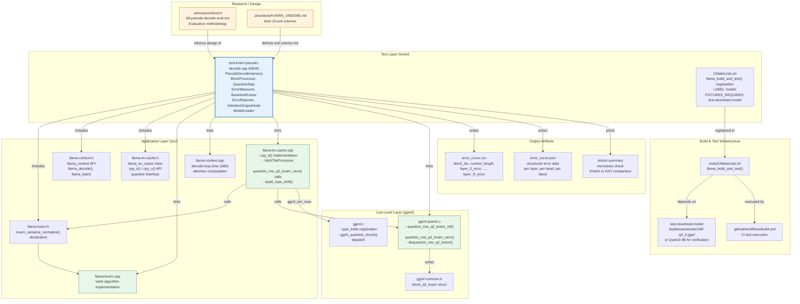

### File Dependency Table

| File | Role | Depends On |
|------|------|------------|
| `tests/test-kvarn-pseudo-decode.cpp` | Main test harness (NEW) | `llama.h`, `llama-kvarn.h`, `llama-context.h`, `llama-kv-cache.h` |
| `tests/CMakeLists.txt` | Test registration | `llama_build_and_test()` function |
| `src/llama-kvarn.h` | VarN function declarations | None (standalone header) |
| `src/llama-kvarn.cpp` | VarN algorithm | `llama-kvarn.h` |
| `src/llama-kv-cache.cpp` | KV-cache quantize path | `llama-kvarn.h`, `ggml-quants.h` |
| `ggml/src/ggml-quants.c` | Quantize/dequantize primitives | `ggml-common.h` |
| `ggml/src/ggml-common.h` | `block_q2_kvarn` struct | None |

### Build Registration (CMakeLists.txt addition)

```cmake
# In tests/CMakeLists.txt, alongside other kvarn tests:
llama_build_and_test(test-kvarn-pseudo-decode.cpp LABEL "model"
    ARGS -m "${MODEL_DEST}" -p "The meaning of life is" -b 128 -t q2_kvarn)
set_tests_properties(test-kvarn-pseudo-decode PROPERTIES
    FIXTURES_REQUIRED test-download-model)
```

### CLI Interface

```
Usage: test-kvarn-pseudo-decode [options]

Options:
  -m <path>         Model file (GGUF format)
  -p <text>         Prompt text (default: wikitext sample)
  -b <int>          Block size in tokens (default: 128)
  -t <type>         Quantization type: q2_kvarn | q4_0 (default: q2_kvarn)
  --kivi            Also run KIVI Q4_0 comparison
  --csv <path>      Write error curve CSV
  --json <path>     Write error curve JSON
  -v                Verbose output (per-head errors)
  -h                Show help

Exit code:
  0 = all checks passed
  1 = error curve not monotonically increasing
  2 = KVarN curve not below KIVI at all points
```
