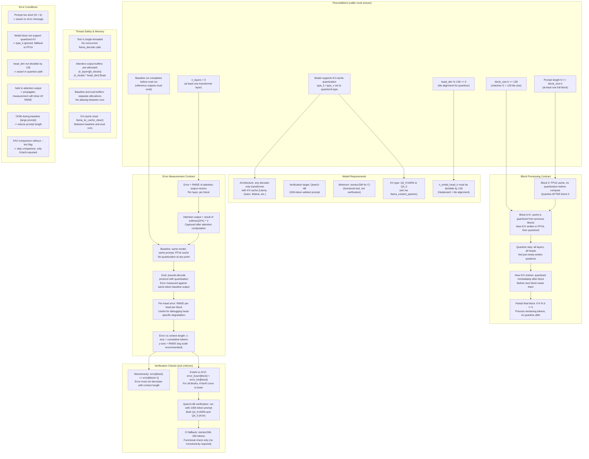

### Safety Contract Summary

| Condition | Assertion / Check | Location |
|-----------|-------------------|----------|
| Prompt length | `assert(N >= b)` | `PseudoDecodeHarness::tokenize_prompt()` |
| Block size | `assert(b == 128)` | `PseudoDecodeHarness` constructor |
| Head dim alignment | `assert(head_dim % 128 == 0)` | `QuantizeStep::quantize_cache()` |
| Baseline exists | `assert(baseline_attn_outputs != nullptr)` | `ErrorMeasurer::compute_all_errors()` |
| KV-cache type | `if (type_k == GGML_TYPE_F32) { skip_quantize; }` | `QuantizeStep::quantize_cache()` |
| Buffer ownership | Caller allocates; harness owns for lifetime | `PseudoDecodeHarness` |
| NaN in output | Not detected; RMSE will be `inf` | `ErrorMeasurer::compute_rmse()` |
| Reset between runs | `llama_kv_cache_clear(ctx)` | Between baseline and eval |
| Monotonicity | `all(errors[block+1] >= errors[block])` | Verification check |
| KVarN < KIVI | `all(errors_kvarn[block] < errors_kivi[block])` | Verification check |

### Model Compatibility Matrix

| Model | head_dim | Compatible | Notes |
|-------|----------|------------|-------|
| Qwen3-4B | 128 | Yes | Verification target |
| Llama 3 8B | 128 | Yes | |
| Llama 2 7B | 128 | Yes | |
| Mistral 7B | 128 | Yes | |
| Qwen2 7B | 128 | Yes | |
| Gemma 2 9B | 256 | Yes | head_dim % 128 == 0 |
| Falcon 7B | 64 | **No** | head_dim < 128 |
| GPT-2 | 64 | **No** | head_dim < 128 |
| stories15M | 64 | **No** (full quant) | CI fallback: functional only |

### Key Design Decisions

1. **Two-pass design**: Baseline (FP16) and eval (quantized) are separate runs. This avoids interference and allows clean RMSE comparison. The KV-cache is cleared between runs.

2. **Block-level measurement**: Error is measured per block (every b tokens), not per token. This matches the quantization granularity and reduces measurement noise.

3. **Quantize after block, not during**: The entire cache is quantized after each block boundary. This matches the paper's protocol and ensures all subsequent tokens see a uniformly quantized cache.

4. **KIVI comparison via re-run**: The `--kivi` flag re-runs the entire pseudo-decode protocol with `type_k = type_v = Q4_0`. This is simpler than running both types simultaneously and avoids cache interference.

5. **CI uses tiny model**: The stories15M model has head_dim=64 which is incompatible with full tile quantization. For CI, the test runs a functional check (process tokens, verify no crash) but skips the error measurement and monotonicity verification. Full verification requires Qwen3-4B.

6. **Error curve properties**: Under pseudo-decode, error is expected to be monotonically increasing because quantization error accumulates across blocks. KVarN's curve grows more slowly than KIVI's because VarN normalization suppresses the magnitude error (E_M) component.
