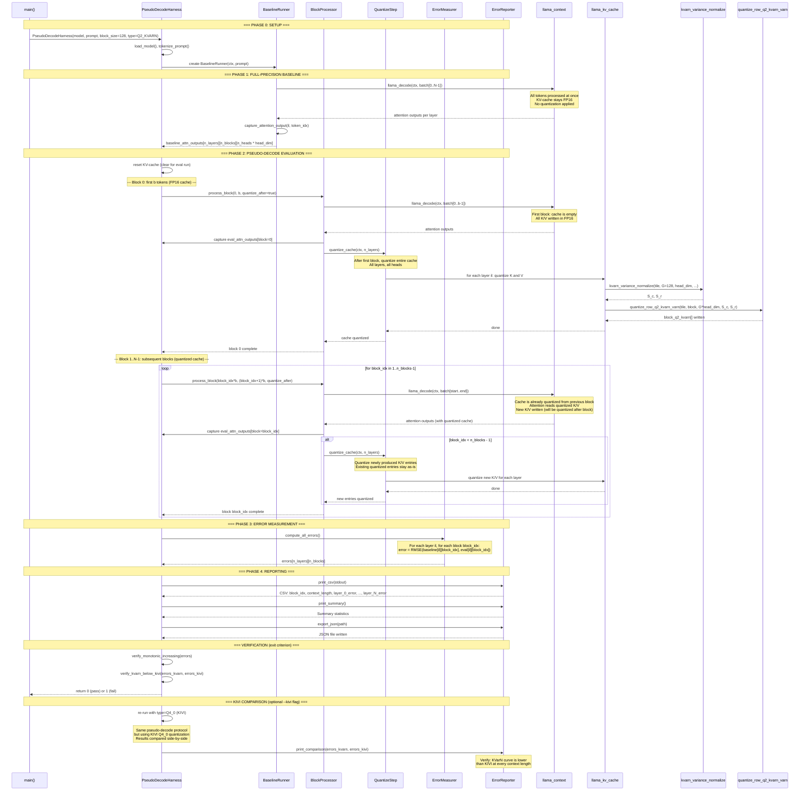

### Block Processing Detail

```
Block 0 (tokens 0..127):
  Cache state: empty
  Action: process FP16, then quantize entire cache
  Error: measured against baseline block 0

Block 1 (tokens 128..255):
  Cache state: quantized (from block 0)
  Action: process with quantized cache, then quantize new entries
  Error: measured against baseline block 1

Block k (tokens k*128 .. (k+1)*128-1):
  Cache state: quantized (accumulated from blocks 0..k-1)
  Action: process with quantized cache, then quantize new entries
  Error: measured against baseline block k
  Note: error accumulates as k increases
```
