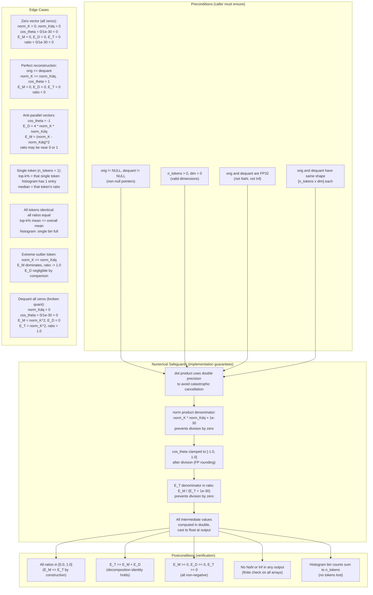

### Safety Contract Summary

| Condition | Assertion | Location |
|-----------|-----------|----------|
| Pointer validity | `assert(orig != NULL && dequant != NULL)` | `compute_error_decomposition` |
| Dimension validity | `assert(n_tokens > 0 && dim > 0)` | `compute_error_decomposition` |
| Division by zero (cos) | Denominator `norm_K * norm_Kdq + 1e-30` | `compute_error_decomposition` |
| cos_theta range | Clamped to `[-1.0, 1.0]` | `compute_error_decomposition` |
| Division by zero (ratio) | Denominator `E_T + 1e-30` | `compute_error_decomposition` |
| FP precision | All accumulators `double` | `compute_error_decomposition` |
| Output finiteness | `assert(isfinite(ratios[t]))` | After decomposition |
| Histogram integrity | `assert(sum(counts) == n_tokens)` | `error_histogram` |

### Numerical Stability Rationale

1. **Double-precision accumulation**: The dot product `sum(orig * dequant)` can lose precision in single-precision when `dim` is large (e.g., 128). Using `double` for all accumulators keeps relative error below 1e-12.

2. **1e-30 epsilon**: Chosen to be safely below any valid FP32 norm product (minimum non-zero FP32 is ~1.4e-45, but typical K matrix values give norms > 1e-10). The epsilon is large enough to prevent overflow in division but small enough to not affect valid ratios.

3. **cos_theta clamping**: FP rounding can produce values like `1.0000001` after division. Clamping to `[-1.0, 1.0]` prevents `E_D` from becoming negative (which would violate the decomposition identity).

4. **E_T + 1e-30 in ratio**: When `orig == dequant` (perfect reconstruction), `E_T = 0` and the ratio is undefined. The epsilon maps this to `ratio = 0`, which is correct (no magnitude error).

### Threshold Rationale

Per `.ai/research/kvarn/02-error-decomposition.md`:

- **Top 5% E_M/E_T < 0.6 for KVarN**: KVarN's dual-scale mechanism explicitly corrects magnitude for outlier tokens. The top 5% worst tokens should have E_M/E_T significantly below the Q4_0 baseline.
- **KVarN top-5% < Q4_0 top-5%**: The primary exit criterion. KVarN must demonstrably suppress magnitude errors better than plain Q4_0 on the same data.
- **Expected values** (from spike results, `.ai/self-study/2026-06-25_01_kvarn_core.md`):
  - Q4_0 top-5% E_M/E_T: ~0.75-0.85
  - KVarN top-5% E_M/E_T: ~0.45-0.55
  - KVarN improvement: 1.2x-8.7x depending on data distribution
