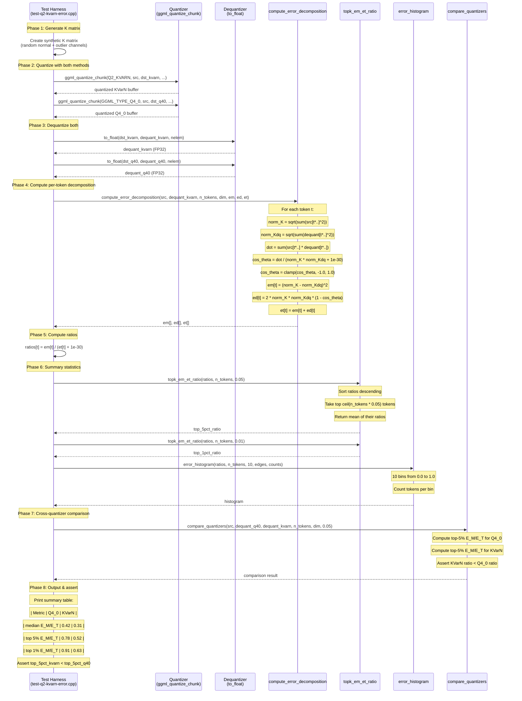

### Computation Pipeline

```
K matrix (FP32)  --[quantize]-->  quantized buffer  --[dequant]-->  K_dq (FP32)
     |                                                                   |
     +----------------------------+--------------------------------------+
                                  |
                                  v
                    compute_error_decomposition()
                                  |
                    +-------------+-------------+
                    |             |             |
                    v             v             v
                  E_M[]         E_D[]         E_T[]
                    |             |             |
                    +------+------+             |
                           |                    |
                           v                    |
                    ratios[t] = E_M/E_T --------+
                           |
              +------------+------------+
              |            |            |
              v            v            v
         top-5% mean   top-1% mean   histogram
              |            |            |
              +------+-----+            |
                     |                  |
                     v                  v
              error_summary struct --> printed table
```
