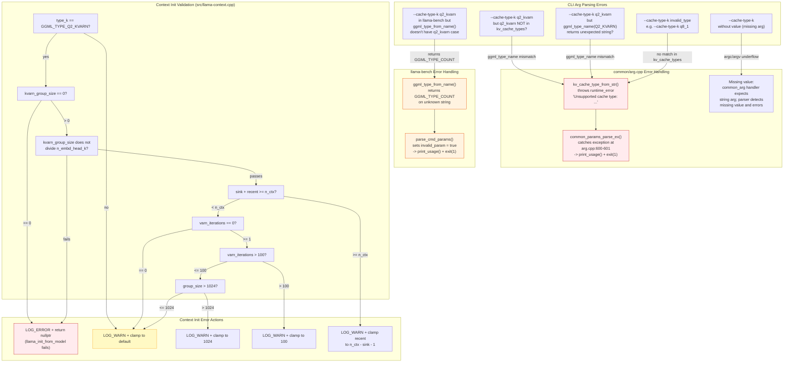

### Error Handling Table

| # | Scenario | Where | Error | User Sees |
|---|---|---|---|---|
| 1 | `--cache-type-k q2_kvarn` but `GGML_TYPE_Q2_KVARN` not in `kv_cache_types` | `common/arg.cpp:318` | `runtime_error("Unsupported cache type: q2_kvarn")` | `error: Unsupported cache type: q2_kvarn` + usage |
| 2 | `--cache-type-k q8_1` (nonexistent type) | `common/arg.cpp:318` | `runtime_error("Unsupported cache type: q8_1")` | `error: Unsupported cache type: q8_1` + usage |
| 3 | `--cache-type-k` without value | `common/arg.cpp` parser | Missing argument detection | `error: ...` + usage |
| 4 | `--cache-type-k q2_kvarn` in llama-bench, no case in `ggml_type_from_name()` | `llama-bench.cpp:504` | Returns `GGML_TYPE_COUNT` | `invalid_param = true` + usage |
| 5 | `type_k=Q2_KVARN` but `kvarn_group_size == 0` | `src/llama-context.cpp` | `LOG_ERROR` + `return nullptr` | `llama_init_from_model() failed` |
| 6 | `kvarn_group_size` does not divide `n_embd_head_k` | `src/llama-context.cpp` | `LOG_ERROR` + `return nullptr` | `llama_init_from_model() failed` |
| 7 | `sink + recent >= n_ctx` | `src/llama-context.cpp` | `LOG_WARN` + clamp recent | Warning log message |
| 8 | `varn_iterations == 0` | `src/llama-context.cpp` | `LOG_WARN` + default to 8 | Warning log message |
| 9 | `varn_iterations > 100` | `src/llama-context.cpp` | `LOG_WARN` + clamp to 100 | Warning log message |
| 10 | `group_size > 1024` | `src/llama-context.cpp` | `LOG_WARN` + clamp to 1024 | Warning log message |

### Validation Flow (llama_init_from_model)

```
type_k == Q2_KVARN?
  |-- NO:  zero KVarN cparams, skip validation
  |-- YES:
       |-- kvarn_group_size == 0?  -> ERROR (return nullptr)
       |-- group_size divides head_dim?  -> ERROR (return nullptr)
       |-- sink + recent >= n_ctx?  -> WARN (clamp recent)
       |-- varn_iterations == 0?  -> WARN (default to 8)
       |-- varn_iterations > 100?  -> WARN (clamp to 100)
       |-- group_size > 1024?  -> WARN (clamp to 1024)
       |-- PASS: copy KVarN params to cparams, proceed
```

### Key Design Decisions

1. **Fail-fast for CLI args**: `kv_cache_type_from_str()` throws immediately on unknown type. The exception propagates to `common_params_parse_ex()` which prints usage and exits. No silent fallback.

2. **Fail-soft for context params**: Validation in `llama_init_from_model()` uses warnings + clamping for out-of-range values, only hard-errors on structural violations (zero group_size, non-divisible group_size). This matches the existing pattern in `08-kvarn-params-exceptions.md`.

3. **llama-bench is separate**: The bench tool has its own parser. If the `q2_kvarn` case is forgotten there, the type string silently returns `GGML_TYPE_COUNT` and the tool exits with usage. This is a compile-time-visible gap (no test coverage for bench's parser).
