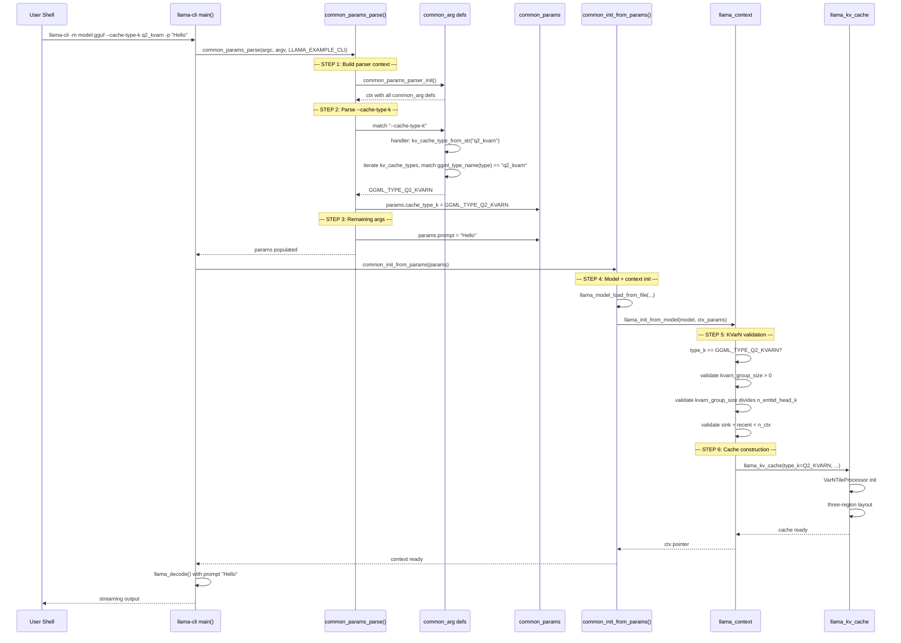

### Flow Summary

```
User: --cache-type-k q2_kvarn
  |
  v
common_params_parse()
  |-- common_params_parser_init()  -- builds option definitions
  |-- match "--cache-type-k"
  |     |-- kv_cache_type_from_str("q2_kvarn")
  |     |     |-- iterate kv_cache_types[]
  |     |     |-- ggml_type_name(GGML_TYPE_Q2_KVARN) == "q2_kvarn"  -> match
  |     |     |-- return GGML_TYPE_Q2_KVARN
  |     |-- params.cache_type_k = GGML_TYPE_Q2_KVARN
  |
  v
common_init_from_params(params)
  |-- llama_init_from_model(model, ctx_params)
  |     |-- validate KVarN params
  |     |-- llama_kv_cache(type_k=Q2_KVARN)
  |     |     |-- VarNTileProcessor init
  |     |     |-- three-region layout
  |     |-- return ctx
  |
  v
llama_decode() -- inference with KVarN cache
```
