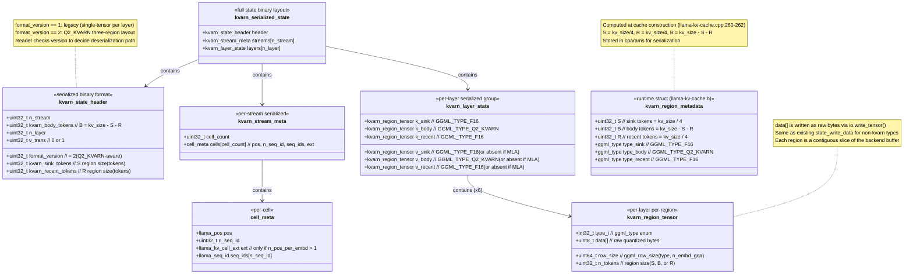

```mermaid
classDiagram

    class kvarn_state_header {
        <<serialized binary format>>
        +uint32_t format_version       // = 2 (Q2_KVARN-aware)
        +uint32_t n_stream
        +uint32_t kvarn_sink_tokens    // S region size (tokens)
        +uint32_t kvarn_recent_tokens  // R region size (tokens)
        +uint32_t kvarn_body_tokens    // B = kv_size - S - R
        +uint32_t n_layer
        +uint32_t v_trans              // 0 or 1
    }

    class kvarn_stream_meta {
        <<per-stream serialized>>
        +uint32_t cell_count
        +cell_meta cells[cell_count]   // pos, n_seq_id, seq_ids, ext
    }

    class cell_meta {
        <<per-cell>>
        +llama_pos pos
        +uint32_t n_seq_id
        +llama_kv_cell_ext ext         // only if n_pos_per_embd > 1
        +llama_seq_id seq_ids[n_seq_id]
    }

    class kvarn_region_tensor {
        <<per-layer per-region>>
        +int32_t  type_i               // ggml_type enum
        +uint64_t row_size             // ggml_row_size(type, n_embd_gqa)
        +uint32_t n_tokens             // region size (S, B, or R)
        +uint8_t  data[]               // raw quantized bytes
    }

    class kvarn_layer_state {
        <<per-layer serialized group>>
        +kvarn_region_tensor k_sink    // GGML_TYPE_F16
        +kvarn_region_tensor k_body    // GGML_TYPE_Q2_KVARN
        +kvarn_region_tensor k_recent  // GGML_TYPE_F16
        +kvarn_region_tensor v_sink    // GGML_TYPE_F16 (or absent if MLA)
        +kvarn_region_tensor v_body    // GGML_TYPE_Q2_KVARN (or absent if MLA)
        +kvarn_region_tensor v_recent  // GGML_TYPE_F16 (or absent if MLA)
    }

    class kvarn_serialized_state {
        <<full state binary layout>>
        +kvarn_state_header   header
        +kvarn_stream_meta    streams[n_stream]
        +kvarn_layer_state    layers[n_layer]
    }

    class kvarn_region_metadata {
        <<runtime struct (llama-kv-cache.h)>>
        +uint32_t S            // sink tokens = kv_size / 4
        +uint32_t B            // body tokens = kv_size - S - R
        +uint32_t R            // recent tokens = kv_size / 4
        +ggml_type type_sink   // GGML_TYPE_F16
        +ggml_type type_body   // GGML_TYPE_Q2_KVARN
        +ggml_type type_recent // GGML_TYPE_F16
    }

    kvarn_serialized_state --> kvarn_state_header : contains
    kvarn_serialized_state --> kvarn_stream_meta : contains
    kvarn_stream_meta --> cell_meta : contains
    kvarn_serialized_state --> kvarn_layer_state : contains
    kvarn_layer_state --> kvarn_region_tensor : contains (x6)

    note for kvarn_state_header "format_version == 1: legacy (single-tensor per layer)<br/>format_version == 2: Q2_KVARN three-region layout<br/>Reader checks version to decide deserialization path"
    note for kvarn_region_tensor "data[] is written as raw bytes via io.write_tensor()<br/>Same as existing state_write_data for non-kvarn types<br/>Each region is a contiguous slice of the backend buffer"
    note for kvarn_region_metadata "Computed at cache construction (llama-kv-cache.cpp:260-262)<br/>S = kv_size/4, R = kv_size/4, B = kv_size - S - R<br/>Stored in cparams for serialization"
```
