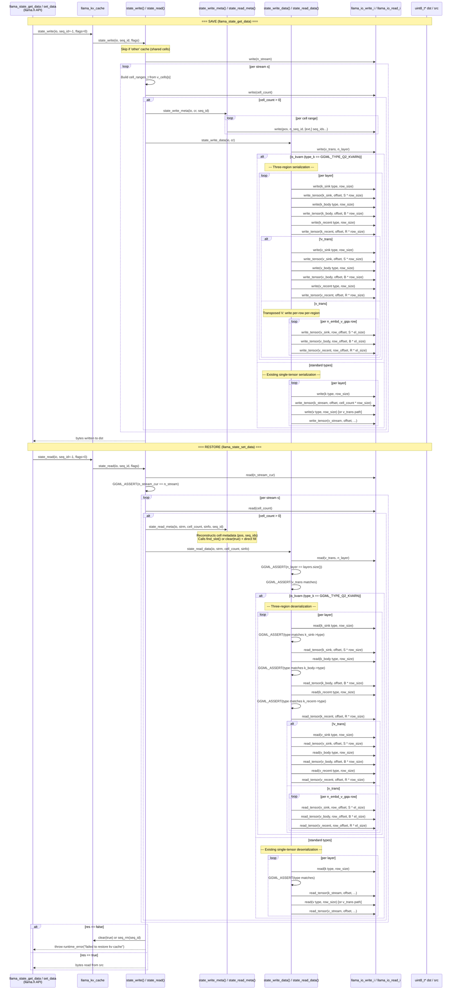

```mermaid
sequenceDiagram
    participant API as llama_state_get_data / set_data<br/>(llama.h API)
    participant KC as llama_kv_cache
    participant W as state_write() / state_read()
    participant WM as state_write_meta() / state_read_meta()
    participant WD as state_write_data() / state_read_data()
    participant IO as llama_io_write_i / llama_io_read_i
    participant BUF as uint8_t* dst / src

    Note over API,BUF: === SAVE (llama_state_get_data) ===

    API->>KC: state_write(io, seq_id=-1, flags=0)
    KC->>W: state_write(io, seq_id, flags)

    Note over W: Skip if 'other' cache (shared cells)

    W->>IO: write(n_stream)

    loop per stream s
        W->>W: Build cell_ranges_t from v_cells[s]
        W->>IO: write(cell_count)
        alt cell_count > 0
            W->>WM: state_write_meta(io, cr, seq_id)
            loop per cell range
                WM->>IO: write(pos, n_seq_id, [ext,] seq_ids...)
            end

            W->>WD: state_write_data(io, cr)
            WD->>IO: write(v_trans, n_layer)

            alt is_kvarn (type_k == GGML_TYPE_Q2_KVARN)
                Note over WD: --- Three-region serialization ---
                loop per layer
                    WD->>IO: write(k_sink type, row_size)
                    WD->>IO: write_tensor(k_sink, offset, S * row_size)
                    WD->>IO: write(k_body type, row_size)
                    WD->>IO: write_tensor(k_body, offset, B * row_size)
                    WD->>IO: write(k_recent type, row_size)
                    WD->>IO: write_tensor(k_recent, offset, R * row_size)

                    alt !v_trans
                        WD->>IO: write(v_sink type, row_size)
                        WD->>IO: write_tensor(v_sink, offset, S * row_size)
                        WD->>IO: write(v_body type, row_size)
                        WD->>IO: write_tensor(v_body, offset, B * row_size)
                        WD->>IO: write(v_recent type, row_size)
                        WD->>IO: write_tensor(v_recent, offset, R * row_size)
                    else v_trans
                        Note over WD: Transposed V: write per-row per-region
                        loop per n_embd_v_gqa row
                            WD->>IO: write_tensor(v_sink, row_offset, S * el_size)
                            WD->>IO: write_tensor(v_body, row_offset, B * el_size)
                            WD->>IO: write_tensor(v_recent, row_offset, R * el_size)
                        end
                    end
                end
            else standard types
                Note over WD: --- Existing single-tensor serialization ---
                loop per layer
                    WD->>IO: write(k type, row_size)
                    WD->>IO: write_tensor(k_stream, offset, cell_count * row_size)
                    WD->>IO: write(v type, row_size) [or v_trans path]
                    WD->>IO: write_tensor(v_stream, offset, ...)
                end
            end
        end
    end

    W-->>API: bytes written to dst

    Note over API,BUF: === RESTORE (llama_state_set_data) ===

    API->>KC: state_read(io, seq_id=-1, flags=0)
    KC->>W: state_read(io, seq_id, flags)

    W->>IO: read(n_stream_cur)
    W->>W: GGML_ASSERT(n_stream_cur == n_stream)

    loop per stream s
        W->>IO: read(cell_count)
        alt cell_count > 0
            W->>WM: state_read_meta(io, strm, cell_count, sinfo, seq_id)
            Note over WM: Reconstructs cell metadata (pos, seq_ids)<br/>Calls find_slot() or clear(true) + direct fill

            W->>WD: state_read_data(io, strm, cell_count, sinfo)
            WD->>IO: read(v_trans, n_layer)
            WD->>WD: GGML_ASSERT(n_layer == layers.size())
            WD->>WD: GGML_ASSERT(v_trans matches)

            alt is_kvarn (type_k == GGML_TYPE_Q2_KVARN)
                Note over WD: --- Three-region deserialization ---
                loop per layer
                    WD->>IO: read(k_sink type, row_size)
                    WD->>WD: GGML_ASSERT(type matches k_sink->type)
                    WD->>IO: read_tensor(k_sink, offset, S * row_size)

                    WD->>IO: read(k_body type, row_size)
                    WD->>WD: GGML_ASSERT(type matches k_body->type)
                    WD->>IO: read_tensor(k_body, offset, B * row_size)

                    WD->>IO: read(k_recent type, row_size)
                    WD->>WD: GGML_ASSERT(type matches k_recent->type)
                    WD->>IO: read_tensor(k_recent, offset, R * row_size)

                    alt !v_trans
                        WD->>IO: read(v_sink type, row_size)
                        WD->>IO: read_tensor(v_sink, offset, S * row_size)
                        WD->>IO: read(v_body type, row_size)
                        WD->>IO: read_tensor(v_body, offset, B * row_size)
                        WD->>IO: read(v_recent type, row_size)
                        WD->>IO: read_tensor(v_recent, offset, R * row_size)
                    else v_trans
                        loop per n_embd_v_gqa row
                            WD->>IO: read_tensor(v_sink, row_offset, S * el_size)
                            WD->>IO: read_tensor(v_body, row_offset, B * el_size)
                            WD->>IO: read_tensor(v_recent, row_offset, R * el_size)
                        end
                    end
                end
            else standard types
                Note over WD: --- Existing single-tensor deserialization ---
                loop per layer
                    WD->>IO: read(k type, row_size)
                    WD->>WD: GGML_ASSERT(type matches)
                    WD->>IO: read_tensor(k_stream, offset, ...)
                    WD->>IO: read(v type, row_size) [or v_trans path]
                    WD->>IO: read_tensor(v_stream, offset, ...)
                end
            end
        end
    end

    alt res == false
        W->>KC: clear(true) or seq_rm(seq_id)
        W-->>API: throw runtime_error("failed to restore kv cache")
    else res == true
        W-->>API: bytes read from src
    end
```
