```mermaid
classDiagram

    class ReasoningBenchmark {
        <<main test class (tests/test-kvarn-reasoning.cpp)>>
        +llama_model* model
        +llama_context* ctx_fp16
        +llama_context* ctx_q4_0
        +llama_context* ctx_q2_kvarn
        +std::vector<Problem> problems          // MATH-500 subset or arithmetic chains
        +int n_predict                           // tokens to generate per problem
        +int n_ctx                               // context window
        +int seed                                // deterministic sampling seed
        +void load_model(const char* path)
        +void tokenize_problems(const char* json_path)
        +int  run_all()
        +int  main(int argc, char** argv)
    }

    class Problem {
        <<struct>>
        +std::string question
        +std::string expected_answer
        +std::vector<llama_token> prompt_tokens
        +bool is_correct(const std::string& generated) const
    }

    class ContextRunner {
        <<helper>>
        +llama_context* ctx
        +llama_sampler* smpl
        +ggml_type type_k
        +ggml_type type_v
        +std::string name                       // "FP16", "Q4_0", "Q2_KVARN"
        +void init(llama_model* model, ggml_type type_k, ggml_type type_v, int seed)
        +std::string generate(const std::vector<llama_token>& prompt, int n_predict)
        +void reset()
    }

    class ResultSet {
        <<struct>>
        +std::string method_name                 // "FP16", "Q4_0", "Q2_KVARN"
        +int correct_count
        +int total_count
        +int64_t total_tokens_generated
        +double accuracy() const                 // correct_count / total_count
        +double avg_tokens() const              // total_tokens / total_count
        +void print_summary() const
    }

    class AnswerExtractor {
        <<helper>>
        +std::string extract_answer(const std::string& generation)
        +bool match_answer(const std::string& extracted, const std::string& expected)
        +std::string normalize(const std::string& s)   // strip whitespace, lowercase
    }

    class AccuracyComparator {
        <<verifier>>
        +const ResultSet& baseline                // FP16
        +const ResultSet& q4_0                    // Q4_0 K-cache
        +const ResultSet& q2_kvarn                // Q2_KVARN K-cache
        +double threshold                          // 0.05 (5% tolerance)
        +bool verify_q2_kvarn_within_5pct_of_fp16() const
        +bool verify_q2_kvarn_ge_q4_0() const
        +bool verify_all() const
        +void print_report() const
    }

    class ProblemLoader {
        <<utility>>
        +std::vector<Problem> load_from_json(const char* path)
        +std::vector<Problem> load_builtin_arithmetic()
        +std::vector<Problem> load_builtin_math500_subset()
    }

    class TokenCounter {
        <<utility>>
        +int64_t count_tokens(const std::string& text)
        +int64_t count_tokens(const std::vector<llama_token>& tokens)
    }

    ReasoningBenchmark --> Problem : contains list
    ReasoningBenchmark --> ContextRunner : creates 3 (FP16, Q4_0, Q2_KVARN)
    ReasoningBenchmark --> ResultSet : collects 3
    ReasoningBenchmark --> AccuracyComparator : creates for verification
    ReasoningBenchmark --> ProblemLoader : creates
    ReasoningBenchmark --> AnswerExtractor : creates
    ReasoningBenchmark --> TokenCounter : creates
    ContextRunner --> ResultSet : produces
    AccuracyComparator --> ResultSet : compares
    ProblemLoader --> Problem : produces

    note for ReasoningBenchmark "Entry point: main()\n\nCLI args:\n  -m <model.gguf>\n  -p <problems.json>  (optional, built-in if omitted)\n  -n <n_predict>      (default 256)\n  --seed <int>        (default 42)\n  --ctx <int>         (default 2048)\n  --csv <path>        (optional output)\n\nExit criterion:\n  Q2_KVARN accuracy >= FP16 accuracy - 5%\n  Q2_KVARN accuracy >= Q4_0 accuracy\n  On at least one model (Qwen3-4B or Phi-4-14B)"
    note for ContextRunner "Wraps llama_context with a specific KV-cache type.\n\nFP16:  type_k = type_v = GGML_TYPE_F32\nQ4_0:  type_k = type_v = GGML_TYPE_Q4_0\nQ2_KVARN: type_k = type_v = GGML_TYPE_Q2_KVARN\n\nUses deterministic sampling (same seed across all three)\nto isolate quantization effects from sampling noise."
    note for AccuracyComparator "Verification logic:\n\n1. Q2_KVARN accuracy >= FP16 accuracy - 0.05\n   (within 5 percentage points of FP16)\n\n2. Q2_KVARN accuracy >= Q4_0 accuracy\n   (at least as good as current best low-bit)\n\n3. Reports pass/fail per check\n   and summary table of all three methods"
```

### Data Flow

```
problems.json (or built-in)
    |
    | ProblemLoader
    v
problems[0..N-1]
    |
    +---> ContextRunner (FP16): for each problem
    |         | generate(prompt, n_predict)
    |         v
    |     results_fp16: {correct_count, total_tokens}
    |
    +---> ContextRunner (Q4_0): for each problem
    |         | generate(prompt, n_predict)
    |         v
    |     results_q4_0: {correct_count, total_tokens}
    |
    +---> ContextRunner (Q2_KVARN): for each problem
    |         | generate(prompt, n_predict)
    |         v
    |     results_q2_kvarn: {correct_count, total_tokens}
    |
    | AccuracyComparator
    v
"PASS: Q2_KVARN within 5% of FP16 (82.4% vs 84.1%)"
"PASS: Q2_KVARN >= Q4_0 (82.4% vs 80.2%)"
```
