```mermaid
graph TD
    subgraph "Test Layer (tests/)"
        TEST_CPP["test-kvarn-reasoning.cpp (NEW)<br/>ReasoningBenchmark<br/>ContextRunner, ResultSet<br/>AnswerExtractor, AccuracyComparator<br/>ProblemLoader, TokenCounter"]
        TEST_CMAKE["CMakeLists.txt<br/>llama_build_and_test() registration<br/>LABEL 'model'<br/>FIXTURES_REQUIRED test-download-model"]
    end

    subgraph "Application Layer (src/)"
        CONTEXT_H["llama-context.h<br/>llama_context API<br/>llama_init_from_model()<br/>llama_decode()"]
        CONTEXT_CPP["llama-context.cpp<br/>decode loop<br/>attention computation"]
        KV_CACHE_H["llama-kv-cache.h<br/>llama_kv_cache class<br/>type_k / type_v"]
        KV_CACHE_CPP["llama-kv-cache.cpp<br/>- cpy_k() with VarN path<br/>- Hadamard rotation<br/>- quantize_row_q2_kvarn_varn()"]
        KVARN_H["llama-kvarn.h<br/>kvarn_variance_normalize()"]
        KVARN_CPP["llama-kvarn.cpp<br/>VarN algorithm"]
        SAMPLER_H["llama-sampling.h<br/>llama_sampler API"]
        SAMPLER_CPP["llama-sampling.cpp<br/>sampler chain"]
        COMMON_H["common.h<br/>common_params, common_init_from_params()"]
        COMMON_CPP["common.cpp<br/>common_batch_clear, common_batch_add"]
    end

    subgraph "Low-Level Layer (ggml/)"
        GGML_COMMON_H["ggml-common.h<br/>block_q2_kvarn struct"]
        GGML_QUANTS_C["ggml-quants.c<br/>- quantize_row_q2_kvarn_ref()<br/>- quantize_row_q2_kvarn_varn()<br/>- dequantize_row_q2_kvarn()"]
        GGML_C["ggml.c<br/>type_traits, ggml_quantize_chunk"]
    end

    subgraph "Research / Design"
        RESEARCH_MD[".ai/research/kvarn/<br/>10-results-summary.md<br/>Target metrics"]
        UNDONE_MD[".ai/undone/KVARN_UNDONE.md<br/>Item 14 exit criterion"]
    end

    subgraph "Build & Test Infrastructure"
        CMAKE_TESTS["tests/CMakeLists.txt<br/>llama_build_and_test()"]
        CI_YML[".github/workflows/build.yml<br/>CI test execution"]
        MODEL_FIXTURE["test-download-model<br/>tinyllamas/stories15M-q4_0.gguf<br/>or Qwen3-4B for verification"]
    end

    subgraph "Test Data"
        PROBLEMS_JSON["problems.json (optional)<br/>MATH-500 subset or<br/>arithmetic chain problems<br/>{question, expected_answer}[]"]
        BUILTIN_PROBLEMS["Built-in arithmetic chains<br/>Fallback when no JSON provided<br/>e.g. 'What is 123 + 456?'"]
    end

    subgraph "Output"
        STDOUT["stdout summary table<br/>Method | Accuracy | Avg Tokens<br/>FP16 | Q4_0 | Q2_KVARN"]
        CSV_OUT["results.csv (optional)<br/>per-problem detail"]
    end

    TEST_CPP -- "includes" --> CONTEXT_H
    TEST_CPP -- "includes" --> KVARN_H
    TEST_CPP -- "includes" --> SAMPLER_H
    TEST_CPP -- "includes" --> COMMON_H
    TEST_CPP -- "links" --> CONTEXT_CPP
    TEST_CPP -- "links" --> KV_CACHE_CPP
    TEST_CPP -- "links" --> KVARN_CPP
    TEST_CPP -- "links" --> SAMPLER_CPP
    TEST_CPP -- "links" --> COMMON_CPP
    TEST_CPP -- "links" --> GGML_QUANTS_C
    TEST_CPP -- "reads" --> PROBLEMS_JSON
    TEST_CPP -- "uses" --> BUILTIN_PROBLEMS
    TEST_CPP -- "writes" --> STDOUT
    TEST_CPP -- "writes" --> CSV_OUT

    KV_CACHE_CPP -- "calls" --> KVARN_H
    KVARN_H --> KVARN_CPP
    KV_CACHE_CPP -- "calls" --> GGML_QUANTS_C
    GGML_QUANTS_C -- "writes" --> GGML_COMMON_H

    TEST_CMAKE -- "registered in" --> CMAKE_TESTS
    CMAKE_TESTS -- "depends on" --> MODEL_FIXTURE
    CMAKE_TESTS -- "executed by" --> CI_YML

    RESEARCH_MD -- "informs threshold of" --> TEST_CPP
    UNDONE_MD -- "defines exit criterion for" --> TEST_CPP

    style TEST_CPP fill:#e3f2fd,stroke:#1565c0,stroke-width:2px
    style KV_CACHE_CPP fill:#e8f5e9,stroke:#2e7d32,stroke-width:1px
    style KVARN_CPP fill:#e8f5e9,stroke:#2e7d32,stroke-width:1px
    style GGML_QUANTS_C fill:#e8f5e9,stroke:#2e7d32,stroke-width:1px
    style RESEARCH_MD fill:#fff3e0,stroke:#e65100,stroke-width:1px
    style UNDONE_MD fill:#fff3e0,stroke:#e65100,stroke-width:1px
    style PROBLEMS_JSON fill:#f3e5f5,stroke:#7b1fa2,stroke-width:1px
    style BUILTIN_PROBLEMS fill:#f3e5f5,stroke:#7b1fa2,stroke-width:1px
```

### File Dependency Table

| File | Role | Depends On |
|------|------|------------|
| `tests/test-kvarn-reasoning.cpp` | Main integration test (NEW) | `llama.h`, `common.h`, `llama-kvarn.h` |
| `tests/CMakeLists.txt` | Test registration | `llama_build_and_test()` function |
| `src/llama-context.h` | Context API | None |
| `src/llama-kvarn.h` | VarN declarations | None |
| `src/llama-kvarn.cpp` | VarN algorithm | `llama-kvarn.h` |
| `src/llama-kv-cache.cpp` | KV-cache quantize path | `llama-kvarn.h`, `ggml-quants.h` |
| `ggml/src/ggml-quants.c` | Quantize/dequantize primitives | `ggml-common.h` |
| `ggml/src/ggml-common.h` | `block_q2_kvarn` struct | None |

### Build Registration (CMakeLists.txt addition)

```cmake
# In tests/CMakeLists.txt, alongside other kvarn tests:
llama_build_and_test(test-kvarn-reasoning.cpp LABEL "model"
    ARGS -m "${MODEL_DEST}" -n 256 --seed 42)
set_tests_properties(test-kvarn-reasoning PROPERTIES
    FIXTURES_REQUIRED test-download-model)
```

### CLI Interface

```
Usage: test-kvarn-reasoning [options]

Options:
  -m <path>         Model file (GGUF format)
  -p <path>         Problems JSON file (optional, built-in if omitted)
  -n <int>          Tokens to generate per problem (default: 256)
  --seed <int>      Random seed for deterministic sampling (default: 42)
  --ctx <int>       Context window size (default: 2048)
  --csv <path>      Write per-problem results CSV
  -v                Verbose output (per-problem details)
  -h                Show help

Exit code:
  0 = all checks passed
  1 = Q2_KVARN accuracy outside 5% of FP16
  2 = Q2_KVARN accuracy below Q4_0 accuracy
  3 = model load failure
```

### Problem JSON Format

```json
[
  {
    "question": "What is 123 + 456?",
    "expected_answer": "579"
  },
  {
    "question": "Solve for x: 2x + 5 = 13",
    "expected_answer": "4"
  }
]
```

Built-in fallback: 10 arithmetic chain problems (addition, subtraction, multiplication) that do not require external data files.
