```mermaid
graph TD
    subgraph "Preconditions (caller must ensure)"
        P1["Model supports KV-cache type override<br/>type_k / type_v settable via llama_context_params"]
        P2["At least one problem loaded<br/>(built-in or from JSON file)"]
        P3["n_predict >= 1<br/>(at least one token to generate)"]
        P4["Same seed across all three runs<br/>(deterministic comparison)"]
        P5["Model has a tokenizer<br/>(needed for prompt tokenization)"]
    end

    subgraph "Model Requirements"
        M1["Architecture: any decoder-only transformer<br/>with KV-cache (Llama, Qwen, Mistral, etc.)"]
        M2["Verification target: Qwen3-4B or Phi-4-14B<br/>(models with published KVarN results)"]
        M3["CI minimum: stories15M<br/>(functional check, not accuracy verification)"]
        M4["KV type support: F32, Q4_0, Q2_KVARN<br/>all must be valid ggml_type values"]
        M5["head_dim must be compatible with Q2_KVARN<br/>(head_dim % 128 == 0 for VarN path)"]
    end

    subgraph "Accuracy Thresholds"
        T1["Q2_KVARN accuracy >= FP16 accuracy - 0.05<br/>(within 5 percentage points)"]
        T2["Q2_KVARN accuracy >= Q4_0 accuracy<br/>(at least as good as current best low-bit)"]
        T3["Threshold applies to at least one model<br/>(not required to pass on all models)"]
        T4["Paper reference targets (Qwen3-4B, MATH500):<br/>FP16: 82.6%, Q2_KVARN: 79.2%<br/>Delta: 3.4pp (well within 5pp)"]
        T5["Paper reference targets (Phi-4-14B, MATH500):<br/>FP16: 84.9%, Q2_KVARN: 84.8%<br/>Delta: 0.1pp (near parity)"]
    end

    subgraph "Three-Run Protocol"
        R1["Run 1: FP16 baseline<br/>type_k = type_v = GGML_TYPE_F32"]
        R2["Run 2: Q4_0 K-cache<br/>type_k = type_v = GGML_TYPE_Q4_0"]
        R3["Run 3: Q2_KVARN K-cache<br/>type_k = type_v = GGML_TYPE_Q2_KVARN"]
        R4["All runs: same model, same seed, same problems<br/>Only KV-cache type differs"]
        R5["KV-cache cleared between problems<br/>(llama_kv_cache_clear)"]
    end

    subgraph "Answer Extraction Contract"
        A1["Extract answer from generated text<br/>Heuristic: last numeric value, or content after 'Answer:'"]
        A2["Normalize: strip whitespace, lowercase<br/>Remove punctuation"]
        A3["Match: exact string comparison after normalization<br/>No partial credit"]
        A4["Fallback: if no answer found, mark as incorrect"]
        A5["Built-in problems use simple numeric answers<br/>No complex parsing needed"]
    end

    subgraph "Thread Safety & Memory"
        S1["Test is single-threaded<br/>Sequential runs: FP16 -> Q4_0 -> Q2_KVARN"]
        S2["Each ContextRunner owns its own llama_context<br/>No sharing between runs"]
        S3["KV-cache cleared between problems<br/>Prevents cross-problem contamination"]
        S4["Model loaded once, shared across all three runs<br/>llama_model is read-only"]
    end

    subgraph "Error Conditions"
        X1["Model does not support Q2_KVARN type<br/>-> llama_init_from_model fails -> return 3"]
        X2["Model does not support Q4_0 type<br/>-> llama_init_from_model fails -> return 3"]
        X3["No problems loaded<br/>-> assert or error message"]
        X4["Generation produces empty output<br/>-> mark as incorrect, continue"]
        X5["OOM during generation (large context)<br/>-> reduce n_ctx or n_predict"]
        X6["JSON file not found or malformed<br/>-> fallback to built-in problems"]
        X7["NaN in logits<br/>-> sampler may crash; test fails"]
    end

    subgraph "CI Behavior"
        C1["CI uses stories15M model<br/>(head_dim=64, not fully compatible)"]
        C2["CI runs functional check only:<br/>- Model loads with all three types<br/>- Generates tokens without crash<br/>- Reports results but does NOT enforce thresholds"]
        C3["Full verification requires manual run<br/>with Qwen3-4B or Phi-4-14B"]
        C4["CI test registered with LABEL 'model'<br/>FIXTURES_REQUIRED test-download-model"]
    end

    P1 --> M1
    P1 --> M4
    P2 --> R1
    P3 --> R4
    P4 --> R4
    P5 --> M1

    M2 --> T4
    M2 --> T5
    M3 --> C1
    M4 --> R1
    M5 --> X1

    T1 --> T2
    T2 --> T3
    T3 --> T4
    T3 --> T5

    R1 --> R2
    R2 --> R3
    R3 --> R4
    R4 --> R5

    A1 --> A2
    A2 --> A3
    A3 --> A4
    A4 --> A5

    C1 --> C2
    C2 --> C3
    C3 --> C4
```

### Safety Contract Summary

| Condition | Assertion / Check | Location |
|-----------|-------------------|----------|
| Model loaded | `assert(model != nullptr)` | `ReasoningBenchmark::load_model()` |
| Problems exist | `assert(!problems.empty())` | `ReasoningBenchmark::run_all()` |
| Context created | `assert(ctx != nullptr)` | `ContextRunner::init()` |
| Same seed | `seed` parameter passed to all three runners | `ReasoningBenchmark::run_all()` |
| KV-cache clear | `llama_kv_cache_clear(ctx)` between problems | `ContextRunner::generate()` |
| Answer extraction | Heuristic; no crash on malformed output | `AnswerExtractor::extract_answer()` |
| Accuracy threshold | `if (q2_kvarn.acc < fp16.acc - 0.05) { fail; }` | `AccuracyComparator::verify_all()` |
| Q4_0 comparison | `if (q2_kvarn.acc < q4_0.acc) { fail; }` | `AccuracyComparator::verify_all()` |
| CI mode | `if (head_dim < 128) { skip_thresholds; }` | `ReasoningBenchmark::run_all()` |
| NaN in logits | Not detected; may cause sampler crash | `llama_sampler_sample()` |

### Model Compatibility Matrix

| Model | head_dim | Q2_KVARN Compatible | Verification Level |
|-------|----------|---------------------|--------------------|
| Qwen3-4B | 128 | Yes | Full (paper target) |
| Phi-4-14B | 128 | Yes | Full (paper target) |
| Llama 3 8B | 128 | Yes | Full |
| Mistral 7B | 128 | Yes | Full |
| Qwen2 7B | 128 | Yes | Full |
| Gemma 2 9B | 256 | Yes | Full |
| Falcon 7B | 64 | No (head_dim < 128) | CI functional only |
| stories15M | 64 | No (head_dim < 128) | CI functional only |

### Key Design Decisions

1. **Three separate contexts, not one**: Each KV-cache type gets its own `llama_context`. This avoids the complexity of changing `type_k`/`type_v` at runtime and ensures clean isolation. The model is shared (read-only).

2. **Deterministic sampling**: Same seed across all three runs ensures that any accuracy difference is solely due to KV-cache quantization quality, not sampling noise. This is critical for a valid comparison.

3. **Built-in problems as fallback**: The test includes a small set of arithmetic problems (10-20) that do not require external files. This makes the test self-contained for CI. Full verification uses a JSON file with MATH-500 subset.

4. **5% threshold, not 1%**: The 5% tolerance accounts for the small problem set (statistical noise) and the fact that this is a CPU-only test (paper results use GPU kernel). The paper shows KVarN is typically within 1-3pp of FP16, so 5% is a conservative bound.

5. **CI skips accuracy checks**: The stories15M model has head_dim=64 which is incompatible with Q2_KVARN's tile size of 128. CI runs a functional check (load, generate, no crash) but does not enforce accuracy thresholds. Full verification requires a manual run with Qwen3-4B or Phi-4-14B.

6. **Answer extraction is simple**: Built-in problems use numeric answers (e.g., "579", "42"). The extractor looks for the last number in the generated text. This avoids the complexity of parsing boxed answers or reasoning chains. For MATH-500 JSON, a more sophisticated extractor may be needed.

7. **Token count reporting**: The test reports average tokens generated per problem for each method. This is a secondary metric that reflects how quantization affects the model's confidence and branching behavior. KVarN should produce token counts closer to FP16 than Q4_0 does.
