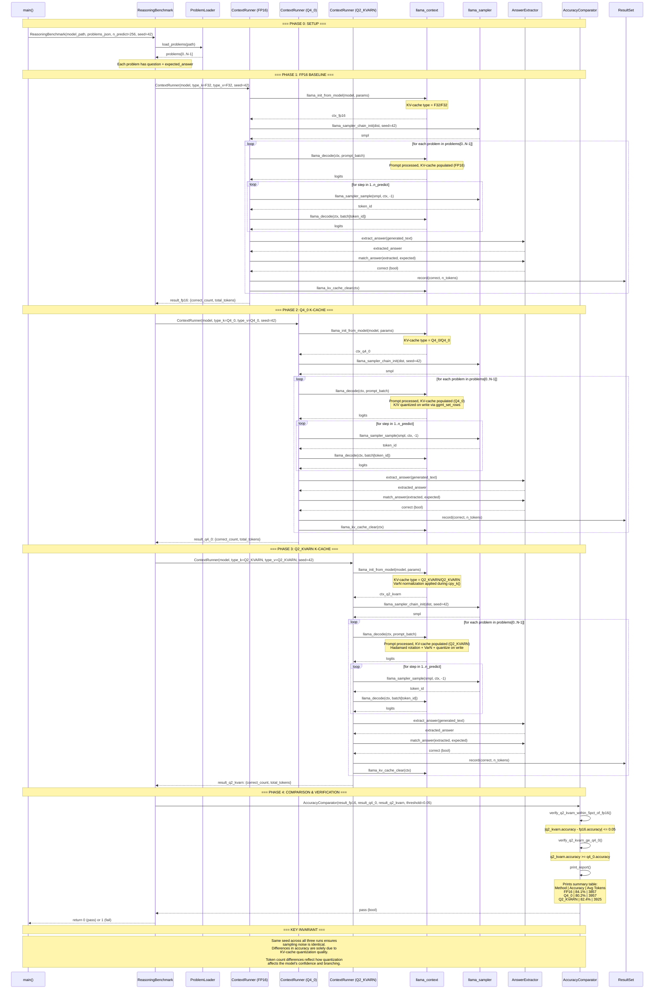

### Per-Problem Detail

```
For each problem:
  1. Tokenize question -> prompt_tokens
  2. llama_decode(prompt) -> populate KV-cache
  3. Autoregressive loop (n_predict steps):
       sample -> decode -> append
  4. Collect full generated text
  5. Extract answer (heuristic: last number, boxed answer, etc.)
  6. Compare against expected_answer
  7. Record: correct? token_count
  8. Clear KV-cache for next problem
```
