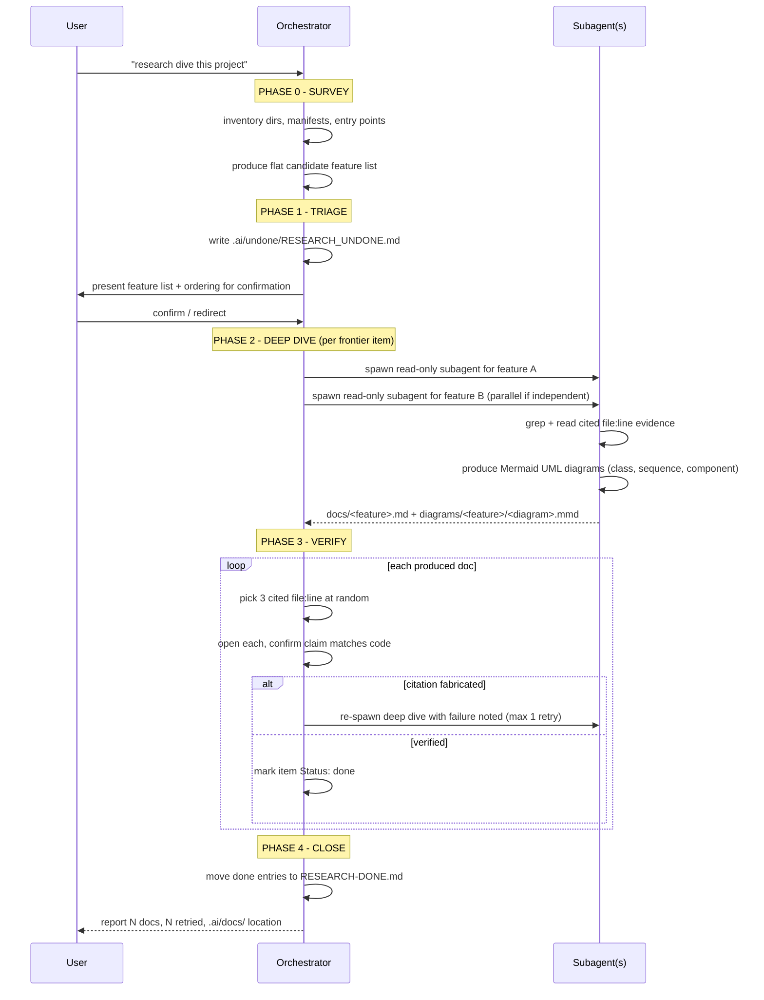

# Research Dive Workflow

## Purpose
Survey an unfamiliar project, produce a research backlog, then document
each major feature by reading the actual code. Output is .ai/docs/ with
Mermaid UML diagrams in .ai/docs/diagrams/, the input is the codebase.
No code is written. No tests are written.

## Pipeline
PHASE 0: SURVEY      Read the project at altitude, identify major features
PHASE 1: TRIAGE      Write .ai/undone/RESEARCH_UNDONE.md - one entry per feature
PHASE 2: DEEP DIVE   Per feature, spawn a subagent to document it in .ai/docs/ and produce Mermaid UML diagrams in .ai/docs/diagrams/
PHASE 3: VERIFY      Spot-check docs + diagrams against code for fabricated claims
PHASE 4: CLOSE       Move completed entries to .ai/done/

## Sequence

## Step-by-Step Protocol

### Phase 0: SURVEY
1. Inventory the repo: directory tree, build files, entry points, README.
   - Top-level dirs only first; do not descend into every file.
2. Identify major features by reading:
   - package manifests (pyproject.toml, package.json, CMakeLists.txt)
   - entry points (main, cli, server bootstrap)
   - top-level module names and their docstrings
   - any existing docs/README structure
3. Produce a flat list of candidate features. A feature is a coherent
   user-facing or system-level capability, NOT a single file. Examples:
   "tokenization", "KV cache management", "server chat completions endpoint"
   - NOT "llama_tokenizer.cpp".
4. Do NOT document yet. The output of phase 0 is the list, nothing else.

### Phase 1: TRIAGE
1. Write .ai/undone/RESEARCH_UNDONE.md. Format follows the undone README
   conventions: each entry has Status, Depends on (usually "nothing"),
   Pipeline: research, and a falsifiable exit criterion.
2. The exit criterion for a research item names the doc artifact that must
   exist and what it must cover:
     "docs/<feature>.md exists and describes inputs, outputs, the code
      path from entry point to result, and the touch points with other
      features - verified by grepping the cited symbols in src/."
   "Documented" alone is not falsifiable.
3. Number items in dependency order where a feature depends on
   understanding another (e.g. "server" depends on "KV cache").
   Independent features can be documented in any order.
4. Present the backlog to the user before deep-diving. Confirm the feature
   list and ordering. Do not proceed on assumptions.

### Phase 2: DEEP DIVE
For each frontier item (dependencies satisfied):
1. Spawn a subagent (general-purpose, read-only) with the prompt:
     "Read the code for <feature>. Produce docs/<feature>.md and
      Mermaid UML diagrams in diagrams/<feature>/ covering:
        - Purpose: what problem this feature solves
        - Entry points: file:function where it starts
        - Data flow: inputs -> transformations -> outputs
        - Key types and protocols
        - Touch points: which other features it calls or is called by
        - Failure modes: how it reports errors
      Every claim must cite a file:line. If you cannot find evidence,
      say so explicitly - do not infer.

      Additionally, produce Mermaid `.mmd` diagrams:
        - class-diagram.mmd   — key types/structs, their fields, methods,
          inheritance and composition relationships
        - sequence-diagram.mmd — the main data/control flow from entry point
          through key transformations to output
        - component-diagram.mmd — subsystems, their boundaries, and how they
          connect (use flowchart or block diagram syntax)
      Place these in diagrams/<feature>/.
      Each diagram must label its nodes with the file:line of the
      corresponding struct, function, or subsystem.
      Every diagram element must be traceable to the code."
2. The subagent must grep and read, not summarize from filenames.
   Filenames are hints, not sources.
3. .ai/docs/ organization - mirror the project's own boundaries:
      - One file per major feature, named after the capability
      - A 00-overview.md index that links to all feature docs
      - If the project has clear subsystem layers (core / api / adapters),
        group docs into subdirectories matching those layers
      - diagrams/ per feature subdirectory under docs/
   Do not impose an external taxonomy. Follow the code's structure.
4. On completion, mark the item's Status: done in RESEARCH_UNDONE.md
   and append a one-line pointer to the doc.

### Phase 3: VERIFY
1. For each produced doc, pick 3 cited file:line references at random.
2. Open each and confirm the doc's claim matches the code.
3. For each diagram in diagrams/<feature>/, verify:
   - Every struct/class label cites a real file:line
   - Every relationship (inheritance, composition, call) is grounded
     in the source (header includes, function calls, pointer fields)
   - Sequence steps match the actual function call chain
4. A doc or diagram with a fabricated citation fails verification.
   Re-spawn the deep-dive agent with the failure noted.
   Maximum 1 retry per feature.
5. Report: N docs verified, N diagrams verified, N with fabricated
   claims, N retried.

### Phase 4: CLOSE
1. Move RESEARCH_UNDONE.md entries with Status: done into a
   RESEARCH-DONE.md (same pattern as the tdd-b cycle's undone -> done).
2. Leave .ai/docs/ and .ai/docs/diagrams/ in place - they are the
   deliverable.

## Invariants
- No code is written. No tests are written. If you find yourself editing
  src/, you have left this workflow.
- Every claim in a doc or diagram cites a file:line. Uncited claims are
  treated as fabricated and fail verification.
- One feature per doc, one diagram set per feature. A doc or diagram that
  covers two features is two docs / two diagram sets.
- The feature list is confirmed with the user before deep-diving begins.
  Research is cheap to redirect at the triage stage and expensive to
  redirect after docs are written.

## Organization of .ai/docs/
The directory follows the project's own layering, not an external schema.
For a project with clear subsystems (e.g. core/ api/ adapters/), the layout
mirrors them. For a flat project, flat docs with an index. The overview
file (00-overview.md) is always present and links everything.

### diagrams/
Each feature gets a subdirectory under diagrams/ named after the feature
(e.g. diagrams/ggml-tensor-library/). Standard diagrams per feature:
- `class-diagram.mmd` — key types/structs with relationships
- `sequence-diagram.mmd` — data/control flow from entry to result
- `component-diagram.mmd` — subsystem boundaries and connections
All nodes and edges cite file:line evidence inline as comments or labels.

## References
- .ai/undone/README.md - item format, lifecycle (shared with other pipelines)
- The project's own README and build manifests - the survey inputs